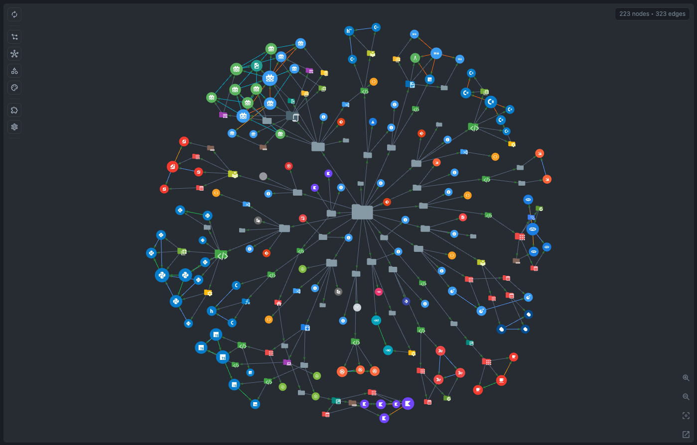
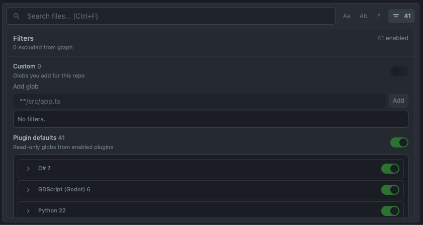
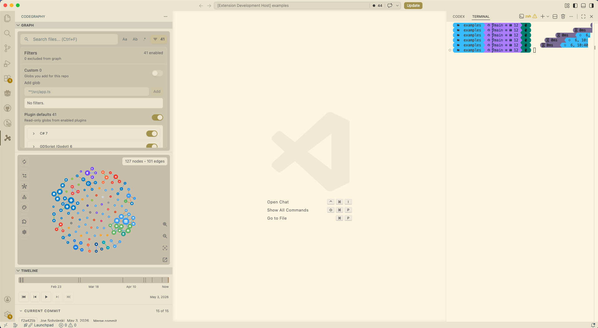
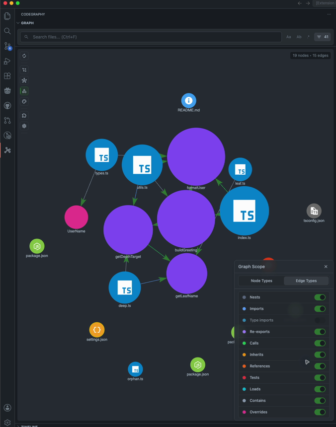
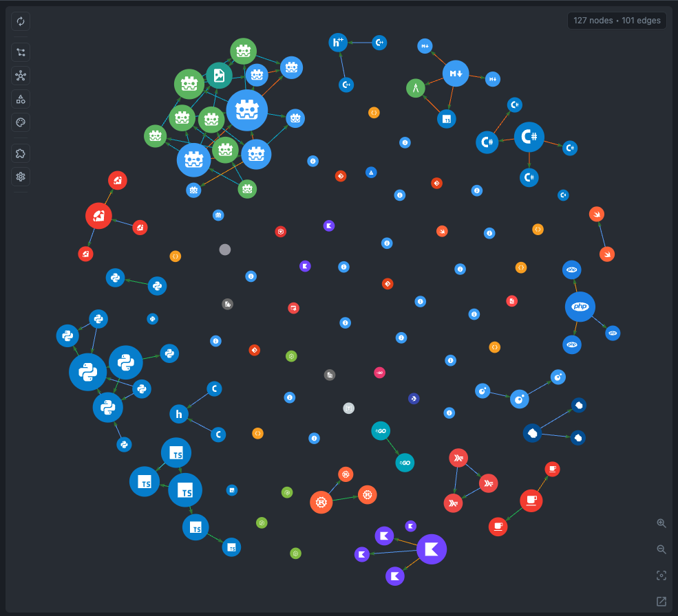
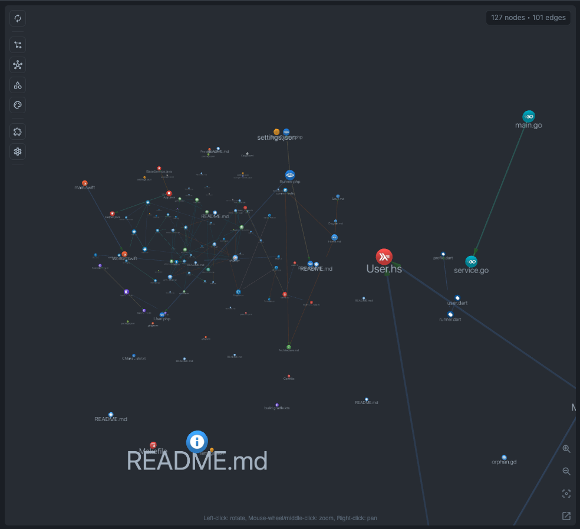
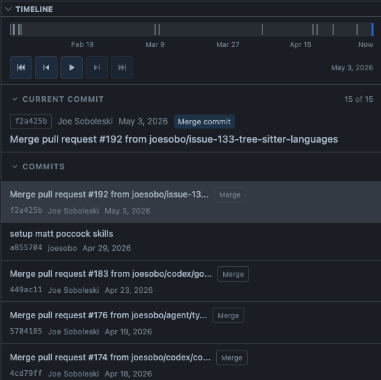
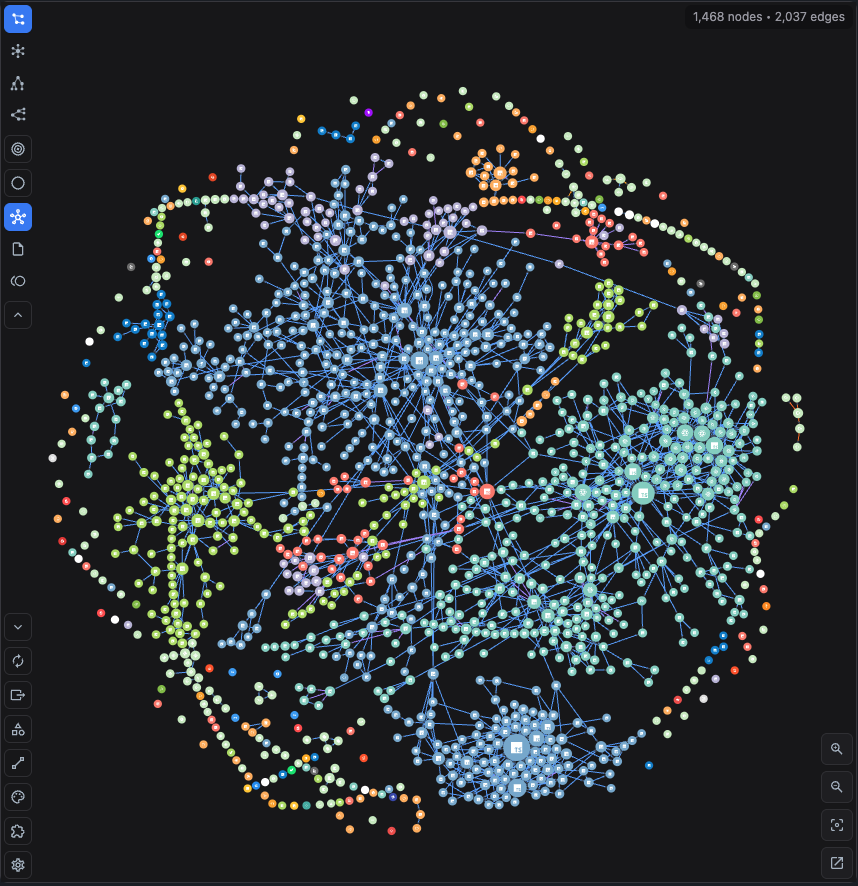

<p align="center">
  
</p>

<h1 align="center">CodeGraphy</h1>

<p align="center">
  A VS Code Relationship Graph for understanding how files and codebase concepts connect.
</p>

<p align="center">
  <a href="https://marketplace.visualstudio.com/items?itemName=codegraphy.codegraphy"></a>
  <a href="https://marketplace.visualstudio.com/items?itemName=codegraphy.codegraphy"></a>
  <a href="https://www.npmjs.com/package/@codegraphy/mcp"></a>
  <a href="https://www.npmjs.com/package/@codegraphy/plugin-api"></a>
  <a href="https://trello.com/b/wG65Lfrb/codegraphy"></a>
</p>

<p align="center">
  <a href="https://marketplace.visualstudio.com/items?itemName=codegraphy.codegraphy">VS Code Extension</a>
  ·
  <a href="https://www.npmjs.com/package/@codegraphy/plugin-typescript">TypeScript/JavaScript Plugin</a>
  ·
  <a href="https://www.npmjs.com/package/@codegraphy/plugin-python">Python Plugin</a>
  ·
  <a href="https://www.npmjs.com/package/@codegraphy/plugin-csharp">C# Plugin</a>
  ·
  <a href="https://www.npmjs.com/package/@codegraphy/plugin-godot">Godot Plugin</a>
  ·
  <a href="https://www.npmjs.com/package/@codegraphy/mcp">MCP</a>
  ·
  <a href="https://www.npmjs.com/package/@codegraphy/plugin-api">Plugin API</a>
</p>

CodeGraphy turns a folder into an interactive Relationship Graph inside VS Code. It starts with File Nodes, then Indexing adds richer Edges from imports, references, calls, tests, folder/package structure, and plugin-provided analysis. The goal is simple: make the relationships between files visible enough that people and agents can navigate a CodeGraphy Workspace without guessing.

This repo is a work in progress and is being built through agentic engineering. It should be useful, but the public surface is still evolving.



## What You Get

| Feature | Why it matters |
|---|---|
| Relationship Graph | See files, folders, packages, plugin nodes, and their Edges in one interactive graph. |
| Symbol Nodes | Expand files into functions, classes, interfaces, types, variables, constants, and plugin-provided declarations when you need code-level context. |
| Search and Filters | Search temporarily, then use persistent Filters to remove generated files, tests, docs, or any other noise from the Visible Graph. |
| Graph Scope | Turn Node Types and Edge Types on or off so the graph matches the question you are asking. |
| Material Icon Theme nodes | File and folder nodes use Material Icon Theme shapes and colors instead of generic dots. |
| VS Code theme integration | Graph surfaces, panels, buttons, text, and directional arrows follow the active VS Code color theme. |
| 2D and 3D renderers | Use the fast 2D canvas for everyday work or switch to 3D WebGL when the shape of the repo matters. |
| Timeline | Index Git history and scrub through how the Relationship Graph changes over commits. |
| Context actions | Preview, open, reveal, rename, delete, favorite, filter, and export directly from the graph. |
| Graph Cache | Store workspace-local analysis and settings in `.codegraphy/` so graph behavior stays with the CodeGraphy Workspace. |
| CodeGraphy MCP | Let agents index and query nodes, edges, relationships, symbols, and bounded paths through `@codegraphy/core` without focusing VS Code. |

## Gallery

| Search and Filters |
|:--:|
|  |

| VS Code Theme Integration |
|:--:|
|  |

| Symbol Nodes |
|:--:|
|  |

| 2D Relationship Graph | 3D Relationship Graph |
|:--:|:--:|
|  |  |

| Timeline |
|:--:|
|  |

| Large Graphs | Force Graph |
|:--:|:--:|
|  |  |

## How It Works


Workspace files, Git history, and workspace-local settings flow into `@codegraphy/core`. The core package owns path-based Indexing, built-in Tree-sitter analysis, enabled plugin execution, Graph Cache reads/writes, and Graph Query. It has no VS Code dependency, so the same engine can run from the VS Code extension, the `codegraphy` CLI, or the local MCP server.

The VS Code extension uses `@codegraphy/core` to build and refresh the workspace Graph Cache, then projects that data into the Visible Graph for the webview, exports, Symbol Nodes, Timeline, and editor interactions. Language and feature plugins are npm packages loaded through core from the user-level installed-plugin cache and the workspace-local `plugins` array; they are not activated as dependent VS Code extensions. `@codegraphy/mcp` uses the same core APIs for headless agent access: `codegraphy index [workspace]` writes the Graph Cache, Graph Query tools read it, and neither path needs to open or focus VS Code.

Symbol Nodes are built from indexed declarations and appear alongside file, folder, package, and plugin nodes when you need code-level context. Common kinds include Function, Class, Interface, Type, Struct, Enum, Variable, and Constant. `contains` Edges connect files to their declarations, and symbol-aware relationship Edges show calls, references, inheritance, overrides, imports, and plugin-provided links when analysis can resolve them. Legend defaults style common symbol kinds automatically, custom Legend Entries can target symbol names, kinds, plugin kinds, languages, or containing file paths, and Graph Query/MCP exposes the same symbol payloads to agents.

The editable Excalidraw source for this diagram lives at [docs/media/readme/codegraphy-architecture.excalidraw](./docs/media/readme/codegraphy-architecture.excalidraw).

## Install

### VS Code

1. Install the [CodeGraphy VS Code Extension](https://marketplace.visualstudio.com/items?itemName=codegraphy.codegraphy).
2. Open a workspace in VS Code.
3. Click the CodeGraphy activity bar icon.
4. Open the graph, then run **Index Workspace** when you want semantic relationships beyond discovered files.
5. Optionally install and enable language plugin npm packages for richer ecosystem defaults.

The VS Code extension bundles `@codegraphy/core`, which already ships native Tree-sitter coverage for JavaScript, TypeScript, TSX, Python, Go, Haskell, Java, Kotlin, Lua, PHP, Ruby, Rust, Swift, Dart, C#, C, and C++. Markdown is a real plugin package and is enabled by default for new CodeGraphy Workspaces.

### Agent Access

```bash
npm install -g @codegraphy/mcp
codegraphy setup
codegraphy index
codex mcp list
```

Then start a new Codex session and ask something like:

```text
Use CodeGraphy to explain how packages/extension/src/webview/app/shell/view.tsx relates to packages/extension/src/webview/components/graph/viewport/view.tsx.
```

See [MCP Setup](./docs/MCP.md) for manual Codex config, JSON examples, and verification prompts.

## CLI Commands

| Command | What It Does |
|---|---|
| `codegraphy setup` | Configures the local CodeGraphy MCP entry for Codex. |
| `codegraphy status [workspace]` | Reports fresh, stale, missing, or unusable Graph Cache state for the current folder or explicit CodeGraphy Workspace. |
| `codegraphy index [workspace]` | Runs Indexing for the current folder or explicit CodeGraphy Workspace through `@codegraphy/core`. |
| `codegraphy plugins refresh` | Records globally installed `@codegraphy/*` plugin packages in `~/.codegraphy/plugins.json`. |
| `codegraphy plugins add <package>` | Records an explicitly named globally installed plugin package. |
| `codegraphy plugins enable <package> [workspace]` | Enables an installed plugin for one CodeGraphy Workspace. |
| `codegraphy plugins disable <package> [workspace]` | Disables an installed plugin for one CodeGraphy Workspace. |
| `codegraphy mcp` | Starts the local stdio MCP server. |

## What Agents Can Query

CodeGraphy MCP is an agent access layer, not a second indexer. It sends explicit Indexing and Graph Query requests to `@codegraphy/core`, reads the same workspace-local Graph Cache as the VS Code extension, and does not need to open or focus VS Code.

| MCP Tool | Agent Can Ask For |
|---|---|
| `codegraphy_status` | Check whether a CodeGraphy Workspace has a fresh, stale, missing, or unusable Graph Cache. |
| `codegraphy_index` | Run explicit Indexing for a CodeGraphy Workspace path. |
| `codegraphy_list_nodes` | List File Nodes, Folder Nodes, Package Nodes, or plugin-added nodes. |
| `codegraphy_list_edges` | List high-level `from` / `to` Edges and grouped Edge Types. |
| `codegraphy_list_relationships` | Inspect relationship evidence grouped by node pair and Edge Type. |
| `codegraphy_list_symbols` | List declarations or symbol-backed relationship evidence. |
| `codegraphy_find_paths` | Find bounded directed paths between exact node paths. |

## Package Map

| Package | Path | Install | What It Owns |
|---|---|---|---|
| `@codegraphy/core` | `packages/core` | `npm install @codegraphy/core` | Shared engine package for Indexing, Graph Cache access, and Graph Query execution. |
| CodeGraphy VS Code Extension | `packages/extension` | [VS Code Marketplace](https://marketplace.visualstudio.com/items?itemName=codegraphy.codegraphy) | Graph View, VS Code lifecycle integration, commands, webviews, context menus, and editor integration. |
| `@codegraphy/mcp` | `packages/mcp` | `npm install -g @codegraphy/mcp` | `codegraphy` CLI and local MCP server for agent access through `@codegraphy/core`. |
| `@codegraphy/plugin-api` | `packages/plugin-api` | `npm install @codegraphy/plugin-api` | Typed contracts for external CodeGraphy plugins. |
| `@codegraphy/plugin-typescript` | `packages/plugin-typescript` | `npm install -g @codegraphy/plugin-typescript` | TypeScript and JavaScript ecosystem defaults and enrichment. |
| `@codegraphy/plugin-python` | `packages/plugin-python` | `npm install -g @codegraphy/plugin-python` | Python ecosystem defaults and enrichment. |
| `@codegraphy/plugin-csharp` | `packages/plugin-csharp` | `npm install -g @codegraphy/plugin-csharp` | C# ecosystem defaults and enrichment. |
| `@codegraphy/plugin-godot` | `packages/plugin-godot` | `npm install -g @codegraphy/plugin-godot` | Godot project, scene, resource, and script enrichment. |
| `@codegraphy/plugin-markdown` | `packages/plugin-markdown` | installed through `@codegraphy/core` | Markdown wikilink and note relationship enrichment enabled by default for new CodeGraphy Workspaces. |
| Quality tools | `packages/quality-tools` | private workspace package | Architecture, coverage-risk, mutation, reachability, and test-shape checks. |

## Tech Stack

| Area | Stack |
|---|---|
| Monorepo | pnpm workspaces, Turbo, Changesets |
| Core package | TypeScript, Tree-sitter, LadybugDB, headless plugin execution |
| VS Code extension | TypeScript, VS Code Extension API |
| Analysis | Native Tree-sitter plus plugin-provided analyzers |
| Graph storage | LadybugDB-backed `.codegraphy/graph.lbug` Graph Cache |
| Webview | React, Vite, Zustand, Tailwind, Radix/shadcn-owned UI primitives |
| Graph rendering | `react-force-graph`, canvas 2D, Three.js/WebGL 3D |
| Theming | VS Code color tokens, Material Icon Theme assets |
| Agent bridge | MCP stdio server and `codegraphy` CLI |
| Quality | Vitest, Playwright, ESLint, CRAP, Stryker mutation, repo-owned quality tools |

## Development

```bash
pnpm install
pnpm run build
pnpm run dev
pnpm run test
pnpm run lint
pnpm run typecheck
```

Useful focused commands:

```bash
pnpm run build:devhost
pnpm --filter @codegraphy/extension test
pnpm --filter @codegraphy/extension exec vitest run --config vitest.config.ts tests/webview/SettingsPanel.test.tsx
```

Plugin authors should start with the [Plugin Guide](./docs/PLUGINS.md), the [plugin lifecycle docs](./docs/plugin-api/LIFECYCLE.md), and [`@codegraphy/plugin-api`](https://www.npmjs.com/package/@codegraphy/plugin-api).

## Project State

CodeGraphy V4 is the current monorepo rewrite after earlier experiments in [V1](https://github.com/joesobo/CodeGraphy), [V2](https://github.com/joesobo/CodeGraphyV2), and [V3](https://github.com/joesobo/CodeGraphyV3). The central idea is still the same: code is easier to understand when the relationships between files are visible.

The active roadmap lives on [Trello](https://trello.com/b/wG65Lfrb/codegraphy). GitHub issues are not the primary tracker for this repo right now.

## Documentation

| Doc | Covers |
|---|---|
| [Timeline](./docs/TIMELINE.md) | Git history playback and incremental indexing. |
| [Settings](./docs/SETTINGS.md) | `.codegraphy/settings.json`, panels, and Settings Controls. |
| [Export menu](./docs/INTERACTIONS.md#export) | Graph Export JSON/Markdown/image output plus Index Export symbol JSON. |
| [Commands](./docs/COMMANDS.md) | Command Palette reference. |
| [Keybindings](./docs/KEYBINDINGS.md) | Keyboard shortcuts. |
| [Interactions](./docs/INTERACTIONS.md) | Mouse, context menu, toolbar, panels, and timeline behavior. |
| [Plugin Guide](./docs/PLUGINS.md) | Build and package plugins for CodeGraphy. |
| [MCP Setup](./docs/MCP.md) | CLI commands, MCP tools, Codex setup, and verification flow. |
| [MCP Package](./packages/mcp/README.md) | Package-level install, commands, tools, prompts, and skill link. |
| [CodeGraphy MCP Skill](./skills/codegraphy-mcp/SKILL.md) | Reusable skill that teaches agents to use CodeGraphy first for relationship and impact questions. |
| [Contributing](./CONTRIBUTING.md) | Development setup and contribution workflow. |

## License

MIT
