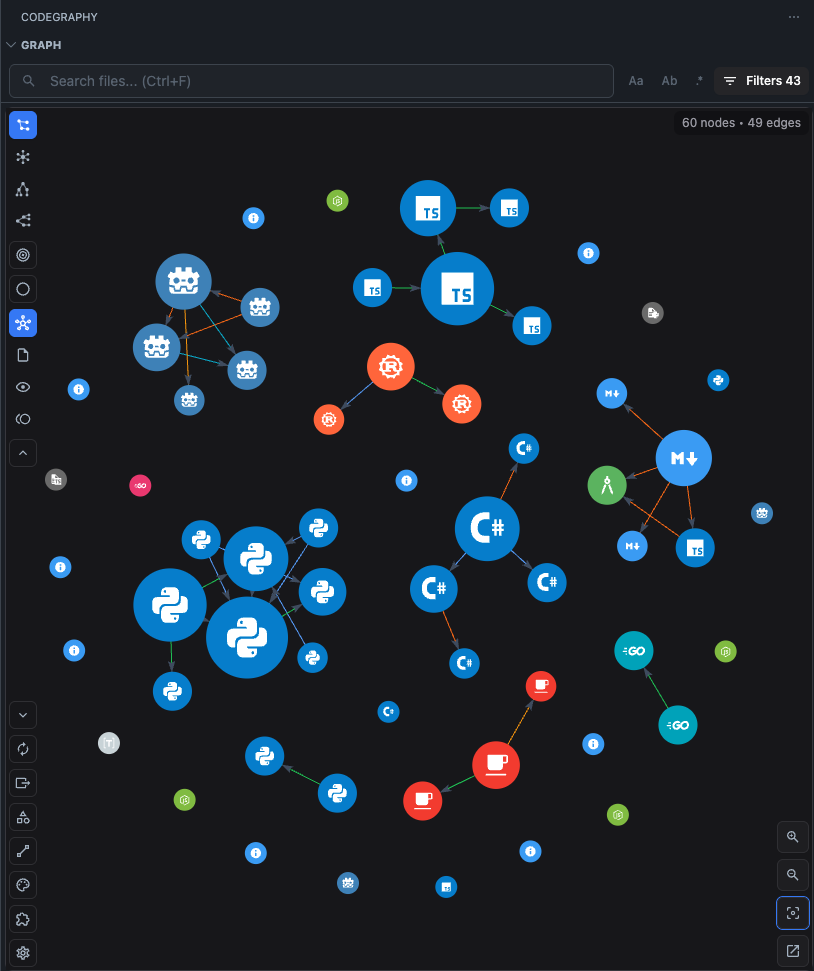

  

<h1 align="center">CodeGraphy</h1>

  Visualize relationships

  
  
  
  

  <a href="https://marketplace.visualstudio.com/items?itemName=codegraphy.codegraphy">Core</a>
  ·
  <a href="https://marketplace.visualstudio.com/items?itemName=codegraphy.codegraphy-typescript">TypeScript/JavaScript Plugin</a>
  ·
  <a href="https://marketplace.visualstudio.com/items?itemName=codegraphy.codegraphy-python">Python Plugin</a>
  ·
  <a href="https://marketplace.visualstudio.com/items?itemName=codegraphy.codegraphy-csharp">C# Plugin</a>
  ·
  <a href="https://marketplace.visualstudio.com/items?itemName=codegraphy.codegraphy-godot">GDScript Plugin</a>
  ·
  <a href="https://www.npmjs.com/package/@codegraphy-vscode/plugin-api">Plugin API</a>

CodeGraphy turns repository structure and code relationships into a Relationship Graph inside VS Code. Files start as File Nodes, indexing projects richer Edges into the graph, and the whole repo becomes something you can inspect, filter, and navigate instead of infer.

Now with Material Icon Theme!

## CodeGraphy History

I originally came up with CodeGraphy back in college in 2021 after seeing 's graph. I've always been a very visual thinker and so Obsidians graph felt very intuitive to me. The clusters of nodes that appeared represented bundles of knowledge that was closely entangled. These clusters reminded me of the way that code worked and the way files related to each other (whether importing, extending, referencing). I wanted to see those relationships in my code, just like in Obsidian's graph, and see what insights I could learn from it. And thats where CodeGraphy was born.

The first iteration was https://github.com/joesobo/CodeGraphy. Its pretty rough, but the core idea is there.

V2 was the last published version: https://github.com/joesobo/CodeGraphyV2. This version was a huge upgrade, enabling dynamic physics and a ton more features. But it was largely limited to Javascript

So I started working on V3 https://github.com/joesobo/CodeGraphyV3 this time with a broader scope. Instead of limited ourselves to a single language. The goal was to make the core renderer reusable and let plugins teach it new language semantics when needed.

Unfortunately I got quite busy and never was able to maintain V2 or finish V3.

CodeGraphy V4 is a ground-up for the 4th time. Probably wont be the last time either. This time its been primarily programmed via Codex. Ive followed the same concepts as the previous iterations of CodeGraphy compacted in this monorepo, as a means to test out agentic programming and different methodologies of doing so. This is not a serious project, I am doing this to learn. The project should work but I make no promises. Feel free to fork or look at any of the previous versions if you are interested in the project. Or hell submit an issue or PR.

## Monorepo

- the core extension focused on graph rendering, repo-local indexing, and the VS Code/webview bridge
- example language plugins for:
  - Typescript
  - C#
  - Python
  - Godot
  - Markdown
- typed npm package [`@codegraphy-vscode/plugin-api`](https://www.npmjs.com/package/@codegraphy-vscode/plugin-api)
- quality tooling so refactors can be enforced (based on some of Uncle Bob's ideas):
  - boundaries
  - organize checks
  - mutation testing
  - CRAP
  - SCRAP

## Core Stack

- TypeScript
- VS Code extension host
- React webview
- Vite
- native Tree-sitter in the extension core
- LadybugDB for repo-local index storage
- `react-force-graph` + Three.js
- repo-local `.codegraphy/` settings + metadata
- shared per-file analysis results merged in plugin priority order
- pnpm monorepo

## What you get

**Relationship Graph** Open any project and CodeGraphy shows discovered File Nodes immediately. Index the repo to project richer Edges into the same Graph View. Drag nodes, zoom, search, and filter without switching to a separate built-in view.

**Core pipeline, plugins for enrichment** The Core Extension owns discovery, caching, Graph Projection, repo-local settings, and export flow. Built-in and external Plugins contribute per-file analysis results, richer Relationships, extra Node Types and Edge Types, and UI integrations.

**Broad Tree-sitter baseline** The core now ships native Tree-sitter coverage for JavaScript, TypeScript, TSX, Python, Go, Java, Rust, and C#. That means many repos produce useful semantic edges before you install any language plugin at all.

**Explorer-style theming in core** The core extension now vendors `material-icon-theme` and uses it as the default file and folder theming layer. File nodes take the Material icon color as their base node color and render the icon in white. Folder nodes keep the configured folder color and render the original Material folder icon as-is.

**One graph, configurable scope** Use the `Nodes`, `Edges`, `Legends`, and `Plugins` popups to choose Graph Scope, Legend styling, and Plugin state. Turn on Depth Mode from the toolbar when you want a focused local graph around the current Focused Node.

**Git timeline playback** Index your repository history, scrub through commits, and watch the Relationship Graph evolve over time.

**Repo-local graph settings and cache** CodeGraphy stores its Graph Cache and repo-specific Settings under `.codegraphy/`, so graph behavior, styling, toggles, and cached analysis stay with the repo instead of polluting `.vscode/settings.json`.

**Configurable graph presentation** Tune the physics, switch between 2D and 3D, adjust node sizes, choose Graph Scope by Node Type and Edge Type, assign glob-based Legend Entries, and filter out noise.

**Exports from cached graph data** Graph Export the current Visible Graph as JSON/Markdown/image output, and Index Export lightweight symbol JSON from the warmed index without re-scanning the repo.

| 2D | 3D |
|:--:|:--:|
|  |  |

**Actions from the graph** Preview, open, rename, delete, favorite, and inspect File Nodes directly from the graph. Single-click previews a File Node, double-click opens it persistently, and non-file nodes can still be selected and focused.

## Install

1. Install the [CodeGraphy core extension](https://marketplace.visualstudio.com/items?itemName=codegraphy.codegraphy).
2. Optionally install plugins for unsupported languages or richer semantics. Core already handles JavaScript, TypeScript, TSX, Python, Go, Java, Rust, and C# through Tree-sitter, and Markdown ships built in.
3. Click the **CodeGraphy** activity bar icon in VS Code.
4. Open the graph.
5. Click **Index Repo** when you want to visualize relationships.

## Legend Precedence

Legend styling is cumulative and resolves in this order:

1. Core defaults
   - Material Icon Theme file and folder matches
   - Defaults entries such as Files and Packages
2. Plugin defaults
3. Custom Legend Entries

Higher layers override lower ones only for the fields they set.

## Development

Want to build your own language plugin? Start with the [Plugin Guide](./docs/PLUGINS.md), the [plugin lifecycle docs](./docs/plugin-api/LIFECYCLE.md), and [`@codegraphy-vscode/plugin-api`](https://www.npmjs.com/package/@codegraphy-vscode/plugin-api).

## Documentation

| | |
|---|---|
| [Timeline](./docs/TIMELINE.md) | Git history playback and incremental indexing |
| [Settings](./docs/SETTINGS.md) | `.codegraphy/settings.json`, panels, and Settings Controls |
| Export menu | Graph Export JSON/Markdown/image plus Index Export symbol JSON |
| [Commands](./docs/COMMANDS.md) | Command palette reference |
| [Keybindings](./docs/KEYBINDINGS.md) | Keyboard shortcuts |
| [Interactions](./docs/INTERACTIONS.md) | Mouse, context menu, toolbar, and panels |
| [Plugin Guide](./docs/PLUGINS.md) | Build and package plugins for CodeGraphy |
| [Contributing](./CONTRIBUTING.md) | Development setup and contribution workflow |

## License

MIT
