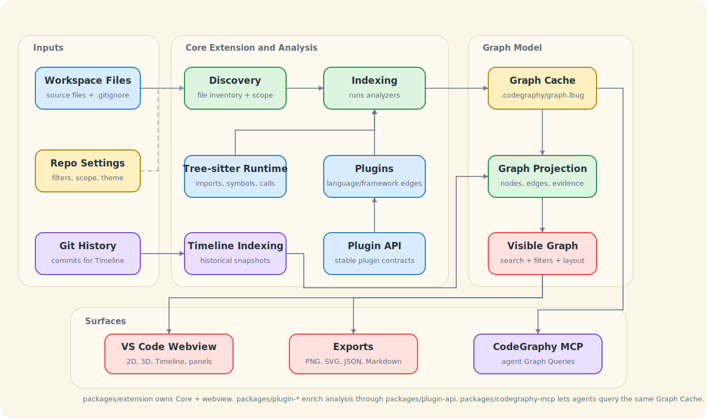

<p align="center">
  
</p>

<h1 align="center">CodeGraphy</h1>

<p align="center">
  A VS Code Relationship Graph for understanding how files and codebase concepts connect.
</p>

<p align="center">
  <a href="https://marketplace.visualstudio.com/items?itemName=codegraphy.codegraphy"></a>
  <a href="https://marketplace.visualstudio.com/items?itemName=codegraphy.codegraphy"></a>
  <a href="https://www.npmjs.com/package/@codegraphy-vscode/mcp"></a>
  <a href="https://www.npmjs.com/package/@codegraphy-vscode/plugin-api"></a>
  <a href="https://trello.com/b/wG65Lfrb/codegraphy"></a>
</p>

<p align="center">
  <a href="https://marketplace.visualstudio.com/items?itemName=codegraphy.codegraphy">Core Extension</a>
  ·
  <a href="https://marketplace.visualstudio.com/items?itemName=codegraphy.codegraphy-typescript">TypeScript/JavaScript Plugin</a>
  ·
  <a href="https://marketplace.visualstudio.com/items?itemName=codegraphy.codegraphy-python">Python Plugin</a>
  ·
  <a href="https://marketplace.visualstudio.com/items?itemName=codegraphy.codegraphy-csharp">C# Plugin</a>
  ·
  <a href="https://marketplace.visualstudio.com/items?itemName=codegraphy.codegraphy-godot">GDScript Plugin</a>
  ·
  <a href="https://www.npmjs.com/package/@codegraphy-vscode/mcp">MCP</a>
  ·
  <a href="https://www.npmjs.com/package/@codegraphy-vscode/plugin-api">Plugin API</a>
</p>

CodeGraphy turns a repository into an interactive Relationship Graph inside VS Code. It starts with File Nodes, then Indexing adds richer Edges from imports, references, calls, tests, folder/package structure, and plugin-provided analysis. The goal is simple: make the relationships between files visible enough that people and agents can navigate the codebase without guessing.

This repo is a work in progress and is being built through agentic engineering. It should be useful, but the public surface is still evolving.


## What You Get

| Feature | Why it matters |
|---|---|
| Relationship Graph | See files, folders, packages, plugin nodes, and their Edges in one interactive graph. |
| Search and Filters | Search temporarily, then use persistent Filters to remove generated files, tests, docs, or any other noise from the Visible Graph. |
| Graph Scope | Turn Node Types and Edge Types on or off so the graph matches the question you are asking. |
| Material Icon Theme nodes | File and folder nodes use Material Icon Theme shapes and colors instead of generic dots. |
| VS Code theme integration | Graph surfaces, panels, buttons, text, and directional arrows follow the active VS Code color theme. |
| 2D and 3D renderers | Use the fast 2D canvas for everyday work or switch to 3D WebGL when the shape of the repo matters. |
| Timeline | Index Git history and scrub through how the Relationship Graph changes over commits. |
| Context actions | Preview, open, reveal, rename, delete, favorite, filter, and export directly from the graph. |
| Graph Cache | Store repo-local analysis and settings in `.codegraphy/` so graph behavior stays with the repo. |
| CodeGraphy MCP | Let agents query nodes, edges, relationships, symbols, and bounded paths through the Core Extension. |

## Gallery

| Search and Filters |
|:--:|
|  |

| VS Code Theme Integration |
|:--:|
|  |

| 2D Relationship Graph | 3D Relationship Graph |
|:--:|:--:|
|  |  |

| Timeline |
|:--:|
|  |

| Large Graphs | Force Graph |
|:--:|:--:|
|  |  |

## How It Works



Workspace files, Git history, and repo-local settings flow into the Core Extension. Indexing combines built-in Tree-sitter analysis with enabled plugins, stores relationship evidence in the Graph Cache, then Graph Projection produces the Visible Graph that powers the VS Code webview, exports, and CodeGraphy MCP.

The editable Excalidraw source for this diagram lives at [docs/media/readme/codegraphy-architecture.excalidraw](./docs/media/readme/codegraphy-architecture.excalidraw).

## Install

### VS Code

1. Install the [CodeGraphy Core Extension](https://marketplace.visualstudio.com/items?itemName=codegraphy.codegraphy).
2. Open a workspace in VS Code.
3. Click the CodeGraphy activity bar icon.
4. Open the graph, then run **Index Repo** when you want semantic relationships beyond discovered files.
5. Optionally install language plugins for richer ecosystem defaults.

The Core Extension already ships native Tree-sitter coverage for JavaScript, TypeScript, TSX, Python, Go, Haskell, Java, Kotlin, Lua, PHP, Ruby, Rust, Swift, Dart, C#, C, and C++. Markdown ships built in.

### Agent Access

```bash
npm install -g @codegraphy-vscode/mcp
codegraphy setup
codegraphy open .
codegraphy index
codex mcp list
```

Then start a new Codex session and ask something like:

```text
Use CodeGraphy to explain how packages/extension/src/webview/app/shell/view.tsx relates to packages/extension/src/webview/components/graph/viewport/view.tsx.
```

See [MCP Setup](./docs/MCP.md) for manual Codex config, JSON examples, and verification prompts.

## CLI Commands

| Command | What It Does |
|---|---|
| `codegraphy setup` | Configures the local CodeGraphy MCP entry for Codex. |
| `codegraphy open <repo>` | Opens or focuses a repo in VS Code and marks it active for CLI Indexing. |
| `codegraphy index` | Asks the Core Extension to run Indexing for the active repo. |
| `codegraphy list` | Lists locally known repos from `~/.codegraphy/registry.json`. |
| `codegraphy mcp` | Starts the local stdio MCP server. |

## What Agents Can Query

CodeGraphy MCP is an agent access layer, not a second indexer. It opens or focuses VS Code, asks the Core Extension to run Indexing when needed, and sends Graph Query requests through the same graph logic used by the UI.

| MCP Tool | Agent Can Ask For |
|---|---|
| `codegraphy_open_repo` | Open or focus a repo in VS Code and establish the active Core Extension connection. |
| `codegraphy_index_repo` | Run Indexing through the Core Extension. |
| `codegraphy_list_nodes` | List File Nodes, Folder Nodes, Package Nodes, or plugin-added nodes. |
| `codegraphy_list_edges` | List high-level `from` / `to` Edges and grouped Edge Types. |
| `codegraphy_list_relationships` | Inspect relationship evidence grouped by node pair and Edge Type. |
| `codegraphy_list_symbols` | List declarations or symbol-backed relationship evidence. |
| `codegraphy_find_paths` | Find bounded directed paths between exact node paths. |

## Package Map

| Package | Path | Install | What It Owns |
|---|---|---|---|
| CodeGraphy Core Extension | `packages/extension` | [VS Code Marketplace](https://marketplace.visualstudio.com/items?itemName=codegraphy.codegraphy) | Graph View, Indexing, Graph Projection, Graph Cache, repo-local Settings, exports, and Graph Query execution. |
| `@codegraphy-vscode/mcp` | `packages/codegraphy-mcp` | `npm install -g @codegraphy-vscode/mcp` | `codegraphy` CLI and local MCP server for agent access through the Core Extension. |
| `@codegraphy-vscode/plugin-api` | `packages/plugin-api` | `npm install @codegraphy-vscode/plugin-api` | Typed contracts for external CodeGraphy plugins. |
| TypeScript/JavaScript plugin | `packages/plugin-typescript` | [VS Code Marketplace](https://marketplace.visualstudio.com/items?itemName=codegraphy.codegraphy-typescript) | TypeScript and JavaScript ecosystem defaults and enrichment. |
| Python plugin | `packages/plugin-python` | [VS Code Marketplace](https://marketplace.visualstudio.com/items?itemName=codegraphy.codegraphy-python) | Python ecosystem defaults and enrichment. |
| C# plugin | `packages/plugin-csharp` | [VS Code Marketplace](https://marketplace.visualstudio.com/items?itemName=codegraphy.codegraphy-csharp) | C# ecosystem defaults and enrichment. |
| GDScript/Godot plugin | `packages/plugin-godot` | [VS Code Marketplace](https://marketplace.visualstudio.com/items?itemName=codegraphy.codegraphy-godot) | Godot project, scene, resource, and script enrichment. |
| Markdown plugin | `packages/plugin-markdown` | bundled with the Core Extension | Markdown wikilink and note relationship enrichment. |
| Quality tools | `packages/quality-tools` | private workspace package | Architecture, coverage-risk, mutation, reachability, and test-shape checks. |

## Tech Stack

| Area | Stack |
|---|---|
| Monorepo | pnpm workspaces, Turbo, Changesets |
| Core extension | TypeScript, VS Code Extension API |
| Analysis | Native Tree-sitter plus plugin-provided analyzers |
| Graph storage | LadybugDB-backed `.codegraphy/graph.lbug` Graph Cache |
| Webview | React, Vite, Zustand, Tailwind, Radix/shadcn-owned UI primitives |
| Graph rendering | `react-force-graph`, canvas 2D, Three.js/WebGL 3D |
| Theming | VS Code color tokens, Material Icon Theme assets |
| Agent bridge | MCP stdio server and `codegraphy` CLI |
| Quality | Vitest, Playwright, ESLint, CRAP, Stryker mutation, repo-owned quality tools |

## Development

```bash
pnpm install
pnpm run build
pnpm run dev
pnpm run test
pnpm run lint
pnpm run typecheck
```

Useful focused commands:

```bash
pnpm run build:devhost
pnpm --filter @codegraphy/extension test
pnpm --filter @codegraphy/extension exec vitest run --config vitest.config.ts tests/webview/SettingsPanel.test.tsx
```

Plugin authors should start with the [Plugin Guide](./docs/PLUGINS.md), the [plugin lifecycle docs](./docs/plugin-api/LIFECYCLE.md), and [`@codegraphy-vscode/plugin-api`](https://www.npmjs.com/package/@codegraphy-vscode/plugin-api).

## Project State

CodeGraphy V4 is the current monorepo rewrite after earlier experiments in [V1](https://github.com/joesobo/CodeGraphy), [V2](https://github.com/joesobo/CodeGraphyV2), and [V3](https://github.com/joesobo/CodeGraphyV3). The central idea is still the same: code is easier to understand when the relationships between files are visible.

The active roadmap lives on [Trello](https://trello.com/b/wG65Lfrb/codegraphy). GitHub issues are not the primary tracker for this repo right now.

## Documentation

| Doc | Covers |
|---|---|
| [Timeline](./docs/TIMELINE.md) | Git history playback and incremental indexing. |
| [Settings](./docs/SETTINGS.md) | `.codegraphy/settings.json`, panels, and Settings Controls. |
| [Export menu](./docs/INTERACTIONS.md#export) | Graph Export JSON/Markdown/image output plus Index Export symbol JSON. |
| [Commands](./docs/COMMANDS.md) | Command Palette reference. |
| [Keybindings](./docs/KEYBINDINGS.md) | Keyboard shortcuts. |
| [Interactions](./docs/INTERACTIONS.md) | Mouse, context menu, toolbar, panels, and timeline behavior. |
| [Plugin Guide](./docs/PLUGINS.md) | Build and package plugins for CodeGraphy. |
| [MCP Setup](./docs/MCP.md) | CLI commands, MCP tools, Codex setup, and verification flow. |
| [MCP Package](./packages/codegraphy-mcp/README.md) | Package-level install, commands, tools, prompts, and skill link. |
| [CodeGraphy MCP Skill](./skills/codegraphy-mcp/SKILL.md) | Reusable skill that teaches agents to use CodeGraphy first for relationship and impact questions. |
| [Contributing](./CONTRIBUTING.md) | Development setup and contribution workflow. |

## License

MIT
