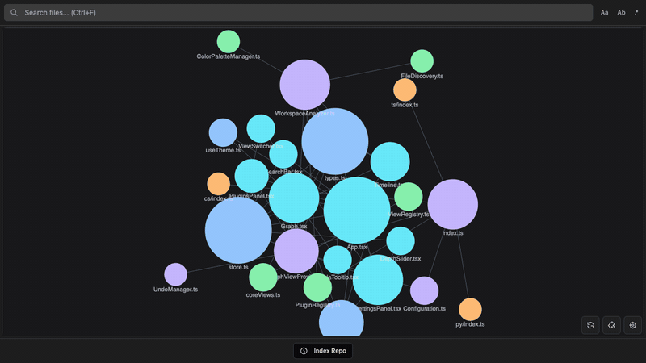
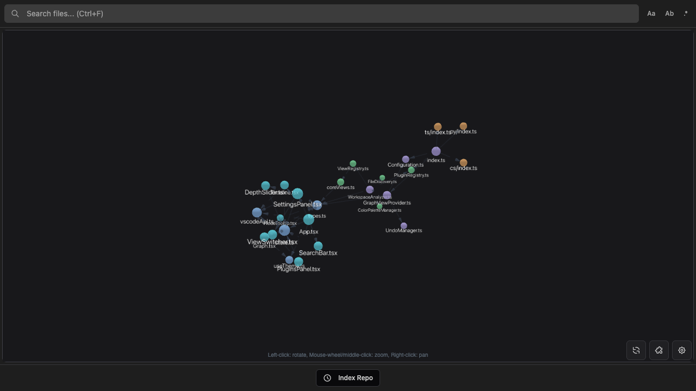
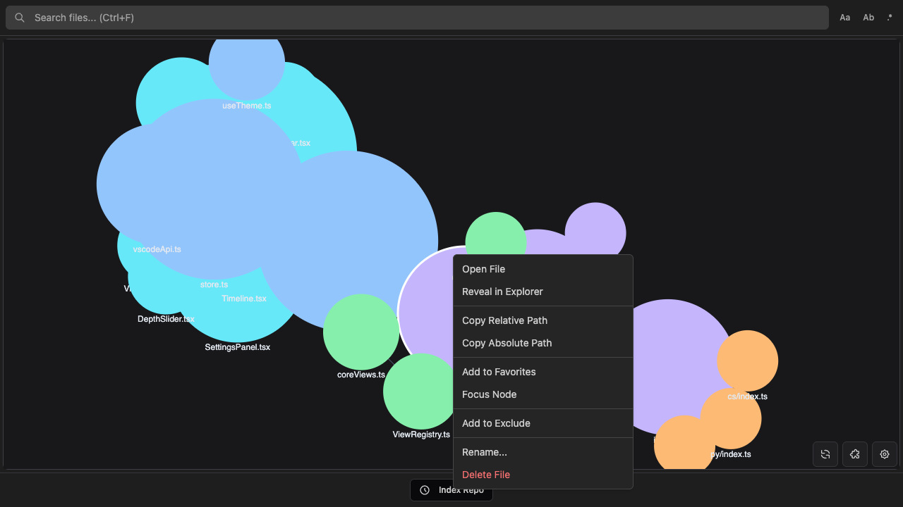

# CodeGraphy

See your codebase. Understand it spatially.

CodeGraphy turns file dependencies into an interactive force graph inside VS Code. Files become nodes, imports become edges, and your project's structure reveals itself.

## Why

Reading code is linear. Codebases aren't. CodeGraphy gives you a bird's-eye view of how files connect so you can spot clusters, find entry points, and understand architecture at a glance.

## What you get

**A live dependency graph.** Open any project and watch it map itself. Files naturally cluster based on their relationships. Drag nodes, zoom in, search, and the graph responds instantly.

**Five languages built in.** TypeScript, JavaScript, Python, C#, GDScript, and Markdown are all supported out of the box. Each plugin detects imports using proper parsers, not regex guesses. You can toggle individual detection rules on or off from the Plugins panel, and those toggles persist in VS Code settings.

**Multiple perspectives.** Switch between views to see your project differently:
- **Connections** shows the full dependency graph
- **Depth Graph** radiates outward from any file, 1 to 5 hops deep
- **Subfolder** scopes the graph to a single directory

**Git timeline.** Index your repo's history and watch the dependency graph evolve over time. Scrub through commits, play back changes at adjustable speed, and see how your architecture grew.

**Make it yours.** Assign colors to files with glob patterns. Tune the physics. Filter out noise. Switch between 2D and 3D. Export as PNG, SVG, or JSON.

| 2D | 3D |
|:--:|:--:|
|  |  |

**Work from the graph.** Right-click any node to open, rename, delete, or favorite files, all with full undo/redo. Double-click to jump straight to the source.

## Quick start

1. Install CodeGraphy from the VS Code Marketplace
2. Click the **CodeGraphy** icon in the activity bar
3. Explore

## Language support

| Plugin | Extensions | Detection |
|--------|-----------|-----------|
| TypeScript / JavaScript | `.ts` `.tsx` `.js` `.jsx` `.mjs` `.cjs` | ES6 imports, CommonJS, dynamic imports, re-exports |
| Python | `.py` `.pyi` | `import`, `from ... import`, relative imports |
| C# | `.cs` | `using` directives, type usage |
| GDScript | `.gd` | `preload`, `load`, `extends`, `class_name` |
| Markdown | `.md` `.mdx` | `[[wikilinks]]` with aliases, paths, and embeds |

Want to add a language? See the [Plugin Guide](./docs/PLUGINS.md).

## Documentation

| | |
|---|---|
| [Timeline](./docs/TIMELINE.md) | Git history playback and scrubbing |
| [Settings](./docs/SETTINGS.md) | Physics, groups, filters, display options |
| [Commands](./docs/COMMANDS.md) | Command palette reference |
| [Keybindings](./docs/KEYBINDINGS.md) | Keyboard shortcuts |
| [Interactions](./docs/INTERACTIONS.md) | Mouse, context menu, tooltips, panels |
| [Plugin Guide](./docs/PLUGINS.md) | Create language plugins |
| [Contributing](./CONTRIBUTING.md) | Development setup and guidelines |

## License

MIT
