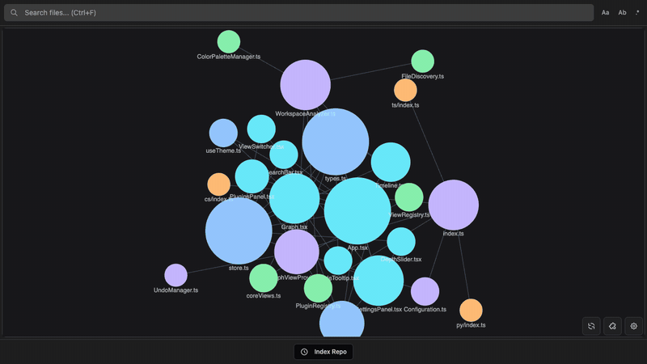
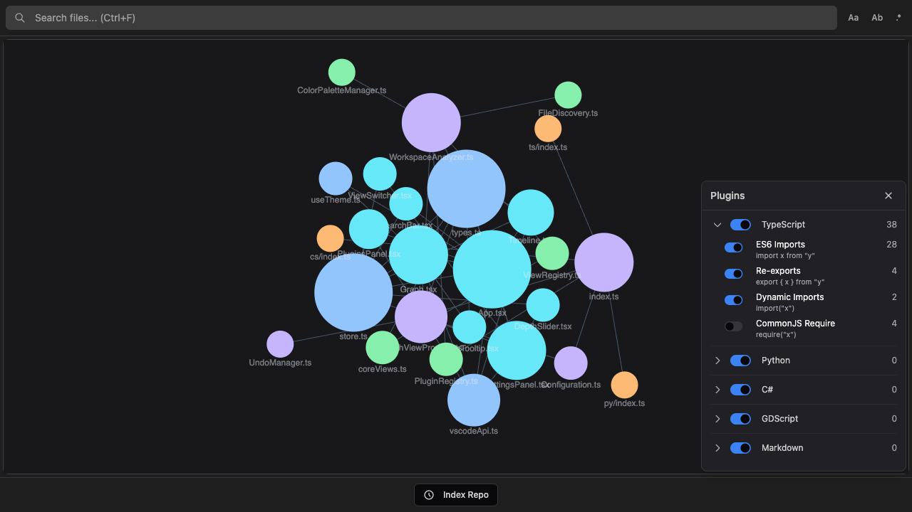

# Graph Interactions

## Nodes

| Action | Effect |
|--------|--------|
| Click | Select the node and reveal the file in the editor |
| Double-click | Open the file in the editor |
| Right-click | Open the context menu |
| `Ctrl+Click` (macOS) | Open the context menu (same as right-click) |
| Drag | Reposition the node (position is saved) |
| Hover | Show tooltip with file details |
| `Ctrl+Click` / `Cmd+Click` | Add or remove from selection |

## Canvas

| Action | Effect |
|--------|--------|
| Drag | Pan the view |
| Scroll | Zoom in/out |
| Right-click | Open background context menu |
| `Shift+Drag` | Box select multiple nodes |

## Context menu

Right-click background, nodes, multi-node selections, or edges to access context-specific actions:

| Action | Description | Undoable |
|--------|-------------|----------|
| Open File | Open in editor | - |
| Reveal in Explorer | Show in VS Code file explorer | - |
| Copy Path | Copy relative path to clipboard | - |
| Delete | Move file(s) to trash | Yes |
| Rename | Rename file via inline prompt | Yes |
| Create File | Create a new file in the same directory | Yes |
| Toggle Favorite | Mark or unmark with yellow outline | Yes |
| Add to Filter | Hide from graph via filter pattern | Yes |
| Copy Source/Target/Both Paths (edge) | Copy connected file paths from an edge | - |

Undoable actions support `Ctrl+Z` / `Cmd+Z` to undo and `Ctrl+Shift+Z` / `Cmd+Shift+Z` to redo.

Implementation details and the full action/context matrix live in [Context Menu](./CONTEXT_MENU.md).

## Tooltips

Hover any node to see:

- File path relative to workspace
- File size
- Last modified (relative timestamp like "2h ago")
- Incoming connections (files that import this)
- Outgoing connections (files this imports)
- Visit count
- Handling plugin

## Panels

Three buttons appear in the bottom-right corner of the graph. Only one panel is open at a time.

### Settings (gear icon)

Four collapsible sections: Forces, Groups, Filters, and Display. See [Settings](./SETTINGS.md) for details.

### Plugins (puzzle icon)

Toggle entire plugins or individual detection rules. Shows live connection counts per rule. Toggle state persists in VS Code settings (`codegraphy.disabledPlugins`, `codegraphy.disabledRules`). See [Plugins](./PLUGINS.md) for plugin development.

### Refresh (arrow icon)

Triggers a full graph re-analysis and layout reset.

## Timeline

The timeline bar appears below the graph after indexing. See [Timeline](./TIMELINE.md) for full details.

| Action | Effect |
|--------|--------|
| Click track | Jump to that point in time |
| Drag track | Scrub through time |
| Play/Pause | Toggle automatic playback |
| Current | Jump to latest commit |
| Double-click node | Preview file at current commit (read-only) |

During timeline mode, destructive context menu actions (Delete, Rename, Create File, Add to Filter) are hidden.

## Export

Export the current graph via the Command Palette:

- **PNG** for a rasterized snapshot at the current zoom and pan
- **SVG** for a scalable vector preserving graph structure
- **JSON** for node positions you can reload later
