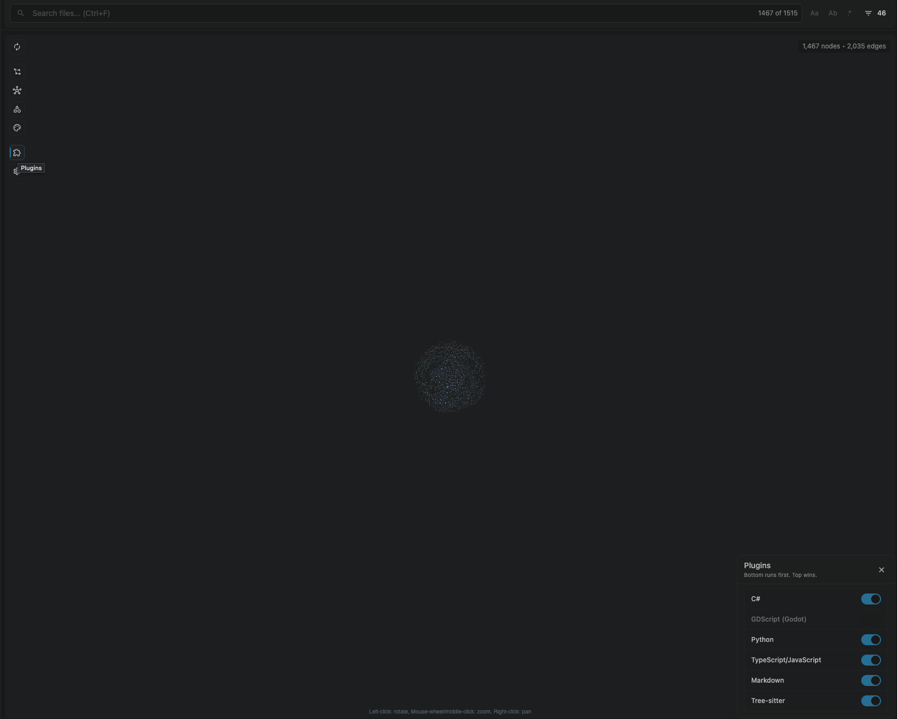

# Graph Interactions

## Nodes

| Action | Effect |
|--------|--------|
| Click | Select and focus the node; File Nodes also open the file in temporary preview |
| Double-click | Select and focus the node; File Nodes also open the file as a persistent editor tab |
| Right-click | Set Context Selection if needed and open the context menu without previewing or opening a file |
| `Ctrl+Click` (macOS) | Open the context menu (same as right-click) |
| Drag | Reposition the node (position is saved) |
| Hover | Show tooltip with file details |
| Hover cursor | Pointer cursor |
| `Ctrl+Click` / `Cmd+Click` | Add or remove from selection |

## Canvas

| Action | Effect |
|--------|--------|
| Left-drag | Box select multiple nodes |
| Shift + left-drag | Add boxed nodes to the current selection |
| Right-drag | Pan the view |
| Scroll | Zoom in/out |
| Hover cursor | Default cursor |
| Right-click | Open background context menu |

## Graph Sections

Graph Sections are editable 2D frames for organizing nodes inside the Relationship Graph.

| Action | Effect |
|--------|--------|
| Toolbar New menu | Create a root-level Graph Section after `New File...` and `New Folder...` |
| Background context menu | Create a Graph Section at the clicked graph position |
| Multi-selection context menu | Create a Graph Section around the selected nodes |
| Drag node into frame | Assign the node to the deepest expanded section under the drop point |
| Drag Section header | Move the whole Section Frame through the root graph layout |
| Resize handles | Resize the expanded Section Frame, respecting the minimum size |
| Header label / color / icon | Rename, recolor, or assign an icon to the Section |
| Collapse / Expand | Collapse the Section into one compact node or expand it back into its frame |

Expanded Section Frames participate in the root force layout as rectangular graph nodes. Section Members run section-local force physics inside the frame, collide with one another and the section body, and can still keep edges to nodes outside the section. Collapsed Sections project member edges onto the compact section node.

## Context menu

Right-click background, nodes, multi-node selections, or edges to access context-specific actions:

| Action | Description | Undoable |
|--------|-------------|----------|
| Open File | Open in editor | - |
| Reveal in Explorer | Show in VS Code file explorer | - |
| Copy Path | Copy relative path to clipboard | - |
| Delete | Move file(s) to trash | Yes |
| Rename | Rename file via inline prompt | Yes |
| Create File | Create a new file in the same directory | Yes |
| Toggle Favorite | Mark or unmark with yellow outline | Yes |
| Add to Filter | Hide from graph via filter pattern | Yes |
| Copy Source/Target/Both Paths (edge) | Copy connected file paths from an edge | - |

Undoable actions support `Ctrl+Z` / `Cmd+Z` to undo and `Ctrl+Shift+Z` / `Cmd+Shift+Z` to redo.

See the fresh root README gallery for current graph UI screenshots.

Historical implementation notes for the first context menu pass live in [archived context menu notes](./archive/context-menu.md).

## Tooltips

Hover any node to see:

- File path relative to workspace
- File size
- Last modified (relative timestamp like "2h ago")
- Incoming relationships
- Outgoing relationships
- Visit count
- Handling plugin

## Toolbar

The toolbar lives in a left-side rail beside the graph. Buttons stay stacked in one column, and opening a control button reveals its panel on the right side of the graph.

**Toolbar Settings Controls:**

| Control | Description |
|---------|-------------|
| Depth Mode toggle | Turns focused depth behavior on or off. |
| Depth slider | Adjusts depth limit (1-5). Only visible when Depth Mode is active. |
| DAG mode buttons | Switch layout: Default (free-form), Radial Out, Top Down, Left to Right. |
| 2D/3D toggle | Switch between 2D canvas and 3D WebGL rendering. |
| Node size buttons | Switch node sizing: Connections, File Size, Churn, or Uniform. |
| Nodes | Opens Graph Scope settings for core and plugin-added Node Types. |
| Edges | Opens Graph Scope settings for Edge Types and shows current edge colors. |
| Index Repo / Re-index Repo | Before indexing: runs Indexing and saves the Graph Cache. After indexing: rebuilds graph data and then refreshes layout. |
| Refresh Graph | Reruns the force graph physics/layout without rebuilding graph data. |
| Export | Dropdown for Graph Export as PNG, SVG, JPEG, JSON, or Markdown, plus Index Export symbol JSON. |
| Legends | Opens Legend Entry editing and Legend Layer priority controls. |
| Plugins | Opens the plugins panel. |
| Settings | Opens the settings panel. |

Toolbar and panel state are driven by repo-local settings in `.codegraphy/settings.json`.

## Panels

Panels open on the right side of the graph. Only one panel is open at a time.

### Settings (gear icon)

Physics and general graph behavior. See [Settings](./SETTINGS.md) for details.

### Nodes (shape icon)

Choose Graph Scope for Node Types such as files, folders, packages, and plugin-added Node Types. Each row also shows the current color for that Node Type.

### Edges (line icon)

Choose Graph Scope for Edge Types such as `NESTS`, imports, calls, references, and plugin-added Edge Types. Each row also shows the current color for that Edge Type.

### Legends (paint icon)

Manage glob-based Legend styling. Legend Entries are grouped as `Custom`, `Plugins`, `Material Icon Theme`, and `Defaults`. Custom entries can be reordered. Core defaults apply first, plugin defaults apply next, and custom entries apply last. Legend Entry Toggles persist in repo settings and disable styling only; they do not hide matching graph items.

### Plugins (puzzle icon)

Toggle whole plugins on or off and drag them to change processing priority. Plugins are processed bottom-to-top, so entries nearer the top win merge conflicts. Built-in plugins show up here too. See [Plugins](./PLUGINS.md) for plugin development.

### Index / Re-index / Refresh (autorenew icon)

Before the repo has an index, use **Index Repo** to run Indexing. After the repo is indexed, **Re-index Repo** rebuilds graph data and then refreshes layout. **Refresh Graph** only reruns the force graph simulation without reprocessing source data.

## Timeline

The timeline bar appears below the graph after indexing. See [Timeline](./TIMELINE.md) for full details.

| Action | Effect |
|--------|--------|
| Click track | Jump to that point in time |
| Drag track | Scrub through time |
| Play/Pause | Toggle automatic playback |
| Current | Jump to latest commit |
| Click node | Select and focus the node; File Nodes open a temporary preview at the selected commit |
| Double-click node | Select and focus the node; File Nodes open the file at the selected commit as a persistent editor tab |

During timeline mode, destructive context menu actions (Delete, Rename, Create File, Add to Filter) are hidden.

## Export

Export from the graph toolbar export menu:

- **PNG** for a rasterized snapshot at the current zoom and pan
- **SVG** for a scalable vector preserving graph structure
- **JSON** for the current Visible Graph with explicit `legend`, `nodes`, and `edges`
- **Markdown** for a readable Visible Graph snapshot with legend, nodes, and edges
- **Symbols JSON** for indexed symbol and relationship data built from the cached analysis store
