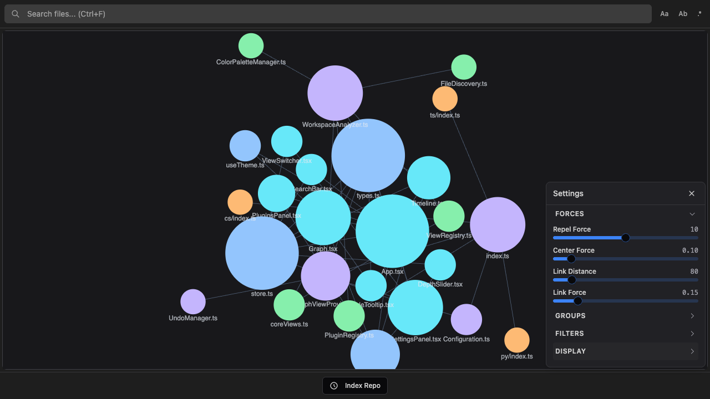
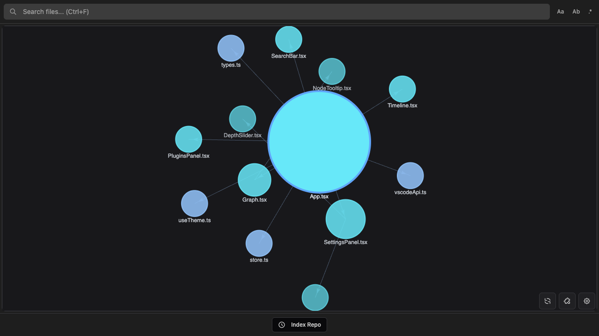

# Settings

CodeGraphy can be configured in two ways:

- **Settings Panel** (the gear icon in the graph view). Changes apply immediately. Some values persist in workspace state, while others map directly to VS Code settings.
- **`settings.json`** (standard VS Code settings). Better for team-shared configuration. Plugin/rule toggles are persisted here (`codegraphy.disabledPlugins`, `codegraphy.disabledRules`).

## VS Code settings reference

| Setting | Type | Default | Description |
|---------|------|---------|-------------|
| `codegraphy.maxFiles` | number | `500` | Maximum files to analyze |
| `codegraphy.include` | string[] | `["**/*"]` | Glob patterns for files to include |
| `codegraphy.filterPatterns` | string[] | `[]` | Glob patterns for files to exclude (appended to built-in excludes) |
| `codegraphy.respectGitignore` | boolean | `true` | Honor `.gitignore` patterns |
| `codegraphy.showOrphans` | boolean | `true` | Show files with no connections |
| `codegraphy.showLabels` | boolean | `true` | Show file name labels on nodes |
| `codegraphy.bidirectionalEdges` | string | `"separate"` | How to display bidirectional connections |
| `codegraphy.directionMode` | string | `"arrows"` | Direction indicator mode: `arrows`, `particles`, or `none` |
| `codegraphy.directionColor` | string | `"#475569"` | Direction indicator color (`#RRGGBB`) |
| `codegraphy.particleSpeed` | number | `0.005` | Particle direction speed (internal range `0.0005`-`0.005`, UI scale `1`-`10`) |
| `codegraphy.particleSize` | number | `4` | Particle size in pixels |
| `codegraphy.favorites` | string[] | `[]` | Favorite file paths (highlighted with yellow border) |
| `codegraphy.groups` | object[] | `[]` | Color groups: `{ id, pattern, color }` |
| `codegraphy.plugins` | string[] | `[]` | VS Code extension IDs that provide external CodeGraphy plugins |
| `codegraphy.disabledRules` | string[] | `[]` | Disabled detection rules as qualified IDs: `<pluginId>:<ruleId>` |
| `codegraphy.disabledPlugins` | string[] | `[]` | Disabled plugin IDs |
| `codegraphy.physics.repelForce` | number | `10` | Node repulsion strength (0-20) |
| `codegraphy.physics.linkDistance` | number | `80` | Preferred distance between connected nodes (30-500) |
| `codegraphy.physics.linkForce` | number | `0.15` | Spring stiffness (0-1) |
| `codegraphy.physics.damping` | number | `0.7` | Motion settling speed (0-1) |
| `codegraphy.physics.centerForce` | number | `0.1` | Pull toward viewport center (0-1) |

## Plugin and rule toggles

The Plugins panel writes toggle state to VS Code settings:

- `codegraphy.disabledPlugins` for whole-plugin toggles
- `codegraphy.disabledRules` for per-rule toggles (`<pluginId>:<ruleId>`)

Example:

```json
{
  "codegraphy.disabledPlugins": ["codegraphy.python"],
  "codegraphy.disabledRules": ["codegraphy.typescript:dynamic-import"]
}
```

These toggles are applied instantly from cached analysis data (no full re-analysis). On older workspaces, CodeGraphy can still read legacy toggle values from workspace state as a fallback.

## Timeline settings

| Setting | Type | Default | Description |
|---------|------|---------|-------------|
| `codegraphy.timeline.maxCommits` | number | `500` | Maximum commits to index (10-5000) |
| `codegraphy.timeline.playbackSpeed` | number | `1.0` | Playback speed multiplier (0.1-10.0) |

Timeline indexing also respects `codegraphy.filterPatterns` and plugin/rule toggle states. See [Timeline](./TIMELINE.md) for details.

## Settings Panel

Open by clicking the gear icon in the bottom-right corner of the graph view. It has four collapsible sections.



### Forces

Adjusts the physics simulation in real time.

| Control | Range | Description |
|---------|-------|-------------|
| Repel Force | 0-20 | How strongly nodes push apart. Higher values spread nodes out more. |
| Center Force | 0-1 | Pull toward the viewport center. |
| Link Distance | 30-500 | Preferred distance between connected nodes in pixels. |
| Link Force | 0-1 | How strongly edges pull connected nodes together. |

### Groups

Assigns colors to files based on glob patterns. All nodes are grey (`#A1A1AA`) by default. Groups are how you add color.

- Enter a glob pattern and pick a hex color, then click Add.
- Click the x button next to any group to delete it.
- Groups are matched in order; the first matching group wins.
- Drag groups to reorder priority.
- Changes sync back to the extension immediately.

Patterns use the same glob syntax as `codegraphy.include`. Both simple extension patterns (`*.ts`) and full path patterns (`src/components/**`) work.

**Example groups:**
```
Pattern: src/**    Color: #3B82F6   (blue, all source files)
Pattern: *.test.*  Color: #10B981   (green, test files)
Pattern: *.md      Color: #6B7280   (grey, documentation)
```

To share groups across a team, add them to `settings.json`:
```json
{
  "codegraphy.groups": [
    { "id": "src", "pattern": "src/**", "color": "#3B82F6" },
    { "id": "tests", "pattern": "*.test.*", "color": "#10B981" }
  ]
}
```

### Filters

Controls which files appear in the graph. These are applied during file discovery, not as a visual filter.

- **Show Orphans** toggles files with no import connections. Equivalent to `codegraphy.showOrphans`.
- **Max Files** limits how many files are analyzed. Equivalent to `codegraphy.maxFiles`.
- **Exclude patterns** are glob patterns for files to hide entirely. Patterns support `matchBase`, so `*.png` excludes PNG files at any depth.

Exclude patterns are appended to the built-in excludes (`node_modules`, `dist`, `build`, etc.).

**Common exclude patterns:**
```
*.png           all PNG images
*.svg           all SVG files
**/*.test.*     all test files
vendor/**       a vendor directory
```

To version-control filter patterns, add them to `settings.json`:
```json
{
  "codegraphy.filterPatterns": ["*.png", "*.svg", "**/*.test.*"]
}
```

### Display

- **Direction** switches between arrows, particles, and none.
- **Direction Color** controls directional indicator color (hex only, `#RRGGBB`).
- **Particle Speed** uses a normalized UI scale from `1` to `10` (mapped to internal `0.0005` to `0.005`).
- **Show Labels** toggles file name labels on nodes. Labels fade in smoothly as you zoom in.
- **Graph Mode** switches between 2D (canvas) and 3D (WebGL) rendering.
- **Node Size** determines what controls node size:
  - `connections` (default): more connections = larger node
  - `file-size`: larger files = larger nodes (logarithmic scale)
  - `access-count`: frequently opened files = larger nodes
  - `uniform`: all nodes the same size
- **View** switches between graph views (see below).
- **Depth** controls how many hops from the focused file to display (1-5) when using the Depth Graph view.

## Graph views

| View | Description |
|------|-------------|
| Connections | Default. Shows all files and their import connections. |
| Depth Graph | Shows files within N hops of the currently focused file. Requires an open editor tab. |
| Subfolder View | Shows files within a specific folder. Activated via Explorer context menu. |



## File discovery settings

### `codegraphy.maxFiles`

Limits the number of files analyzed to prevent performance issues in large repos.

```json
{ "codegraphy.maxFiles": 1000 }
```

When the limit is hit, a warning appears and only the first N files are processed. Use `include` and `filterPatterns` to narrow scope rather than raising this indefinitely.

### `codegraphy.include`

Glob patterns for which files to discover, relative to the workspace root.

```json
{
  "codegraphy.include": ["src/**/*", "lib/**/*"]
}
```

Common patterns:
- `**/*` all files (default)
- `src/**/*` only files in `src/`
- `**/*.ts` only TypeScript files
- `{src,lib}/**/*` multiple directories

### `codegraphy.filterPatterns`

Glob patterns for files to exclude, appended to built-in excludes. Supports `matchBase` so `*.png` matches at any depth.

**Built-in excludes (always applied):**
```
**/node_modules/**
**/dist/**
**/build/**
**/.git/**
**/coverage/**
**/*.min.js
**/*.bundle.js
```

**Adding custom exclusions:**
```json
{
  "codegraphy.filterPatterns": ["*.png", "*.svg", "**/__tests__/**", "vendor/**"]
}
```

Your patterns are merged with the built-ins, so you don't need to repeat them.

### `codegraphy.respectGitignore`

When `true`, reads `.gitignore` and excludes matching files automatically.

```json
{ "codegraphy.respectGitignore": true }
```

### `codegraphy.bidirectionalEdges`

Controls how mutual imports (A imports B and B imports A) are drawn.

```json
{ "codegraphy.bidirectionalEdges": "combined" }
```

- `separate` (default): two arrows, one in each direction (overlapping links are automatically curved apart)
- `combined`: a single line with arrowheads on both ends

This setting is also accessible from the SettingsPanel **Display** section.

## Example configurations

### Small TypeScript project
```json
{
  "codegraphy.maxFiles": 50,
  "codegraphy.include": ["src/**/*"],
  "codegraphy.showOrphans": false
}
```

### Large monorepo (focus on one package)
```json
{
  "codegraphy.maxFiles": 1000,
  "codegraphy.include": ["packages/my-package/src/**/*"],
  "codegraphy.filterPatterns": ["**/*.test.ts", "**/*.spec.ts"]
}
```

### Source files only, no assets
```json
{
  "codegraphy.include": ["**/*.{ts,tsx,js,jsx}"],
  "codegraphy.filterPatterns": ["**/*.d.ts"]
}
```

### Team-shared color groups
```json
{
  "codegraphy.groups": [
    { "id": "features", "pattern": "src/features/**", "color": "#3B82F6" },
    { "id": "shared",   "pattern": "src/shared/**",   "color": "#8B5CF6" },
    { "id": "tests",    "pattern": "**/*.test.*",      "color": "#10B981" }
  ]
}
```

## Workspace vs user settings

| Level | File | Use for |
|-------|------|---------|
| User | `~/.config/Code/User/settings.json` | Personal defaults across all projects |
| Workspace | `.vscode/settings.json` | Project-specific config, committable to version control |

Workspace settings override user settings. We recommend committing `include`, `filterPatterns`, `groups`, and any shared plugin/rule toggles to `.vscode/settings.json` so the whole team sees the same graph.

## Troubleshooting

**Graph is empty**
1. Check that `codegraphy.include` patterns match your files
2. Verify files aren't excluded by `filterPatterns`, `.gitignore`, or the built-in excludes
3. Make sure `codegraphy.maxFiles` is high enough

**Nodes are all grey**

No groups are configured. Add groups in the Settings Panel or via `codegraphy.groups` in `settings.json`.

**Too many files**
1. Add exclusion patterns in the Filters section or `codegraphy.filterPatterns`
2. Narrow `codegraphy.include` to specific directories
3. Lower `codegraphy.maxFiles`

**Missing connections**
1. Make sure the file type has a supported plugin (TypeScript/JS, Python, C#, GDScript, Markdown)
2. Check that imported files are within the `include` patterns
3. `node_modules` imports are intentionally excluded
4. Check `codegraphy.disabledPlugins` and `codegraphy.disabledRules` for an unintended toggle
