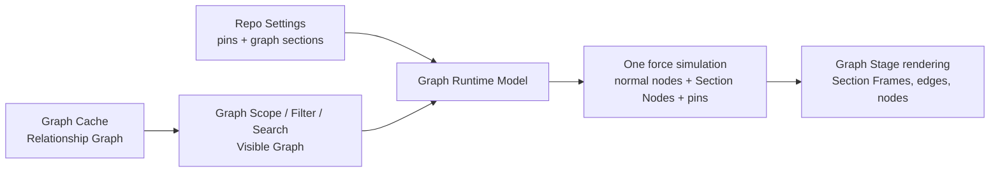

# Graph Sections And Pinnable Nodes Plan

## Setup

- Worktree: `/Users/poleski/Desktop/Projects/CodeGraphyV4-graph-sections-pinning-plan`
- Branch: `codex/graph-sections-pinning-plan`
- PR base branch: `main`
- Domain source: `CONTEXT.md`
- Tracker:
  - Trello #46: `graph node sub containers for organizing code sections`
  - Trello #26: `Pinnable nodes`
  - Trello #20: `Multi node selection`
  - Trello #25: `expandable nodes`
- Status: implementation in progress.

## Goal

Add user-controlled layout features to the **Graph View** without changing what the **Relationship Graph** means:

1. Users can pin any node so it reopens at the same graph-space position and the force layout reacts around it.
2. Users can create resizable visual sections that organize nodes inside the existing graph.
3. Nodes inside a section can still have normal edges to nodes outside the section.
4. A collapsed section can summarize edges crossing the section boundary without losing the original relationships.

## Research Baseline

The current recommendation is to keep one world-space **Relationship Graph** and represent each **Graph Section** as a physics-participating **Section Node** in the rendered graph, not as a nested `react-force-graph` instance.

Prior art points in the same direction:

- React Flow subflows keep child nodes in one graph model with parent-aware positioning.
- yFiles grouped graphs and folding separate grouping from the underlying graph.
- fCoSE compound layout models parent/child graph structure while still solving layout as one compound graph.
- D3 force simulation already supports fixed coordinates through `fx`, `fy`, and `fz`, which maps cleanly to pinning.
- The force-graph multi-selection example linked from Trello #20 is a useful interaction reference for marquee-style multi-node selection.

This matters because cross-section edges are ordinary CodeGraphy edges. If sections were separate graph renderers, every edge that crosses a section boundary would need coordinate conversion, event routing, draw ordering, and collapse semantics across renderer boundaries.

Related tracker notes:

- Trello #20, `Multi node selection`, points at `https://vasturiano.github.io/force-graph/example/multi-selection/`.
- Trello #25, `expandable nodes`, connects expandable/collapsible node behavior to folder structure, collapse, and Depth Mode.

## Product Constraints

- Graph Sections must not mutate the **Graph Cache**. They are user layout state, not indexed graph facts.
- A Graph Section is represented by a **Section Node** in the rendered force layout.
- A Section Node is affected by physics like other graph nodes while expanded or collapsed.
- An expanded Section Node renders as a **Section Frame** that can be moved and resized.
- Pins must not mutate the **Graph Cache**. They are persisted graph layout settings.
- A section member remains a normal **Node** in the **Visible Graph** while the section is expanded.
- An edge from an outside node to an inside node remains an ordinary **Edge** while the section is expanded.
- Section membership must be explicit user intent. A node drifting into a section because of physics should not silently become a member.
- The force layout should remain useful after adding sections. Sections should guide member layout without pulling every member against a boundary.
- Pinned nodes should keep their positions across reloads, refreshes, and re-renders when their node ids still exist.
- A missing node should not delete its pin or section membership immediately. Re-indexing, branch switches, filters, or timeline snapshots can temporarily hide nodes.
- Section and pin behavior must fit existing **Graph Scope**, **Filter**, **Search**, **Show Orphans**, **Depth Mode**, folder nodes, package nodes, and plugin nodes.

## Resolved Decisions

- 2026-05-07: Use **Graph Section** as the canonical product term for the expanded user-created organizing area.
- 2026-05-07: Use **Section Frame** for the visible rectangle, label, color, handles, and selection chrome.
- 2026-05-07: Use **Section Member** for a node assigned to a **Graph Section**.
- 2026-05-07: Use **Section Node** for the physics-participating graph node that represents a **Graph Section** while expanded or collapsed.
- 2026-05-07: Use **Pinned Node** for a node with persisted fixed graph-space position.
- 2026-05-07: Treat Graph Section as CodeGraphy's product term for the prior-art family usually called group nodes, compound nodes, or subflows.
- 2026-05-07: A Graph Section is real in the rendered physics graph but remains user layout state rather than indexed Relationship Graph data.
- 2026-05-07: The Graph View has one rendered physics graph containing ordinary nodes and Section Nodes.
- 2026-05-07: Every visible ordinary node and every Section Node participates in the same force layout.
- 2026-05-07: Expanded Section Members remain force-layout nodes but are bounded to the Section Frame.
- 2026-05-07: While a Graph Section is expanded, outside edges can render directly to a visible Section Member.
- 2026-05-07: While a Graph Section is collapsed, cross-boundary edges render to the collapsed Section Node as a projection of the original edges.
- 2026-05-07: Never render membership as a Section Node to Section Member edge.
- 2026-05-07: A Section Frame is a resizable rectangle with resize handles on its edges.
- 2026-05-07: A Section Frame has a content minimum size based on members, chrome, and padding.
- 2026-05-07: Resizing a Section Frame below its content minimum collapses the Graph Section.
- 2026-05-07: Expanding a collapsed Graph Section restores the Section Frame at least to the current content minimum.
- 2026-05-07: Moving an expanded Section Frame moves its visible Section Members by the same graph-space delta before physics resumes.
- 2026-05-07: Moving an expanded Section Frame also moves visible pinned Section Members and updates their persisted pin coordinates by the same graph-space delta.
- 2026-05-07: Moving a collapsed Section Node also translates hidden Section Members and any persisted member pin coordinates by the same graph-space delta for the next expansion.
- 2026-05-07: Section membership changes only through explicit user intent, not physics drift across a boundary.
- 2026-05-07: Dragging a node into an expanded Section Frame previews membership, and dropping it adds the node as a Section Member.
- 2026-05-07: Dragging a Section Member out of its Section Frame and dropping outside removes membership.
- 2026-05-07: Context menu actions should later support precise `Add Selection to Section` and `Remove from Section` workflows.
- 2026-05-07: Nested sections form an ownership hierarchy. If Section 2 is inside Section 1 and node A is dropped into Section 2, node A belongs directly to Section 2; Section 2 belongs inside Section 1; Section 1 belongs to the root graph.
- 2026-05-07: Support nested Graph Sections out of the gate.
- 2026-05-07: Nesting is recursive: a Graph Section can contain another Graph Section, which can contain its own Section Members and nested Graph Sections.
- 2026-05-07: A node or Graph Section has at most one direct section owner.
- 2026-05-07: Section ownership must prevent cycles.
- 2026-05-07: A parent Section Frame's content minimum includes child Section Frames.
- 2026-05-07: Resizing a parent below the size needed to contain child Section Frames collapses the parent instead of allowing overflow.
- 2026-05-07: Collapsing a parent Graph Section hides descendant sections without changing their own expanded/collapsed state.
- 2026-05-07: Expanding a parent Graph Section restores descendant sections to the state they had before the parent collapse.
- 2026-05-07: Collapsed cross-boundary edges project each original endpoint to its nearest visible representative.
- 2026-05-07: If Section 2 is collapsed inside expanded Section 1, `A -> B inside Section 2` renders as `A -> Section 2`.
- 2026-05-07: If Section 1 is collapsed and hides Section 2, `A -> B inside Section 2` renders as `A -> Section 1`.
- 2026-05-07: Projected cross-boundary edges aggregate by visible source, visible target, and edge type.
- 2026-05-07: Aggregated projected edges preserve their original edge list for tooltip/details/context menu inspection.
- 2026-05-07: Different edge types stay visually distinct instead of merging into one generic edge.
- 2026-05-07: Graph Sections are pinnable because Section Nodes participate in the same force graph as ordinary nodes.
- 2026-05-07: Pinning a Section Node fixes the section's graph-space position without automatically pinning its Section Members.
- 2026-05-07: Moving a pinned Section Node or expanded Section Frame updates the section pin.
- 2026-05-07: Pin positions are stored as graph-space coordinates relative to the graph origin, not viewport pan or zoom.
- 2026-05-07: Viewport pan and zoom move the user's view of the graph but do not change stored graph-space pin coordinates.
- 2026-05-07: Refreshing the graph may recenter the viewport, but pinned nodes remain at their persisted graph-space coordinates.
- 2026-05-07: Pinned Nodes and collapsed Section Nodes need visible graph indicators.
- 2026-05-07: Pinned Nodes show a small pin badge.
- 2026-05-07: Collapsed Section Nodes show a collapsed-section badge plus a hidden-descendant count.
- 2026-05-07: Pinned collapsed Section Nodes show both pin and collapsed/count indicators without overlap.
- 2026-05-07: Expanded Section Frames show a collapse chevron in the header, edge resize handles, and a pin badge in the header when pinned.
- 2026-05-07: Graph Sections have required labels.
- 2026-05-07: New Graph Sections default to generated labels like `Section 1`, `Section 2`, etc.
- 2026-05-07: The label appears in the expanded Section Frame header and on the collapsed Section Node.
- 2026-05-07: Graph Sections support an optional free-form color picker.
- 2026-05-07: New Graph Sections may default to a color derived from the active VS Code theme, but users can choose any color from the color picker.
- 2026-05-07: Section color tints the border/header subtly instead of flood-filling the whole section.
- 2026-05-07: Graph Sections can be created from a Graph Tool Rail add action, the Graph Stage background context menu, or a selection context menu.
- 2026-05-07: The Graph Tool Rail add action should also consider New File and New Folder creation alongside New Graph Section.
- 2026-05-07: `Create Graph Section from Selection` wraps selected nodes or sections with padding and assigns them as members.
- 2026-05-07: Add desktop-style marquee selection to support selecting multiple nodes by dragging a selection rectangle.
- 2026-05-07: Left-click drag on empty Graph Stage should become marquee selection.
- 2026-05-07: Plain right-click should still open the Graph Context Menu; right-click drag can pan only after a movement threshold.
- 2026-05-07: Do not use Space plus left-click drag as the pan fallback.
- 2026-05-07: Shift plus left-click drag is the pan fallback.
- 2026-05-07: Avoid Ctrl plus left-click drag for panning because macOS Ctrl-click commonly maps to context menu behavior.
- 2026-05-07: Graph Section editing is 2D-only in v1.
- 2026-05-07: 3D should not support editable Section Frames, resize handles, marquee section creation, or nested frame manipulation in v1.
- 2026-05-07: Graph Sections and Section Nodes are not rendered in 3D in v1.
- 2026-05-07: Any visible node type can be pinned and can become a Section Member, including File Nodes, Folder Nodes, Package nodes, and Plugin Nodes.
- 2026-05-07: Section membership does not replace folder/package/plugin semantics or structural relationships.
- 2026-05-07: Section membership survives temporary node visibility changes from Graph Scope, Search, Filter, Show Orphans, or similar view settings.
- 2026-05-07: If a hidden member becomes visible again and its owning Graph Section still exists, it returns to that section.
- 2026-05-07: If a hidden member becomes visible again after its owning Graph Section was deleted, it returns to the root graph.
- 2026-05-07: Pin and ownership records can remain dormant while their graph item is hidden or temporarily absent.
- 2026-05-07: If a graph item returns after filtering, search, scope changes, branch changes, or reindexing, its dormant pin and ownership records apply again.
- 2026-05-07: Explicitly deleting a graph item through CodeGraphy removes that item's pin and ownership records.
- 2026-05-07: Section Members use hard visual bounds inside the Section Frame with gentle physics correction away from frame edges.
- 2026-05-07: Members should not render outside their Section Frame after physics ticks settle.
- 2026-05-07: A pinned Section Member moves relative to its owning Section Frame when the section moves.
- 2026-05-07: Dragging a pinned Section Member outside its owning Section Frame updates its pin to the dropped graph-space position and removes it from that Graph Section.
- 2026-05-07: Dragging any Section Member outside its owning Section Frame and dropping it removes the item from that Graph Section.
- 2026-05-07: Implementation order should be persisted layout settings, pinnable nodes, multi-selection/marquee, basic expanded Graph Sections, membership/nesting, section-aware physics, collapse projection, then 2D polish/manual validation.
- 2026-05-07: Graph Tool Rail add action should offer New Graph Section, New File, and New Folder.
- 2026-05-07: A selected Section Frame is a graph placement target for New Graph Section, New File, and New Folder.
- 2026-05-07: A selected Folder Node is a filesystem target for New File and New Folder.
- 2026-05-07: If New File or New Folder is created while a Section Frame is selected, the filesystem destination defaults to root unless a Folder Node target is also selected, and the created node is placed into the selected section after it appears.
- 2026-05-07: If both a Folder Node and Section Frame are selected, New File/New Folder uses the Folder Node as filesystem destination and the Section Frame as graph placement owner.
- 2026-05-07: Renaming or moving a file/folder should preserve its Section Member assignment when CodeGraphy can identify the moved graph item as the same logical item.
- 2026-05-07: `Create Graph Section from Selection` changes only graph ownership/layout. It does not create, remove, or change edges.
- 2026-05-07: Graph Section ids are generated stable ids, not label-derived slugs.
- 2026-05-07: Graph Section labels are editable presentation text and must not be used as identity.
- 2026-05-07: 2D and 3D pins are separate layout records.
- 2026-05-07: A 2D pin stores a 2D graph coordinate and applies only in 2D.
- 2026-05-07: A 3D pin stores a 3D graph coordinate and applies only in 3D.
- 2026-05-07: A normal graph node can have both a 2D pin location and a 3D pin location.
- 2026-05-07: Section Nodes do not support 3D pins in v1 because Graph Sections and Section Nodes are not rendered in 3D.
- 2026-05-07: Selected normal nodes keep the existing selected-node treatment.
- 2026-05-07: Selected collapsed Section Nodes use the selected-node treatment plus collapsed/count badge.
- 2026-05-07: Selected expanded Section Frames show an accent border, subtly tinted header, and visible resize handles.
- 2026-05-07: Active marquee selection shows a visible desktop-style selection rectangle while the user click-drags.
- 2026-05-07: Multi-selected items each show their own selection state; no persistent giant combined bounding box is shown after selection completes.
- 2026-05-07: Depth Mode does not mutate Section Member assignment.
- 2026-05-07: If Depth Mode includes a Section Member, its owning Graph Section should remain visible enough to show containment context even if the section itself is outside hop depth.
- 2026-05-07: For collapsed Graph Sections, Depth Mode uses the collapsed Section Node as the visible representative according to the same nearest-visible projection rules.
- 2026-05-07: Timeline Snapshots do not show Pinned Nodes or Graph Sections in v1.
- 2026-05-07: Timeline Snapshots do not allow creating, editing, resizing, moving, pinning, unpinning, collapsing, expanding, or deleting Graph Sections in v1.
- 2026-05-07: Persist section ownership in a normalized ownership index instead of storing member ids inside each section.
- 2026-05-07: Sections store visual/layout state separately from ownership.
- 2026-05-07: Deleting only a Graph Section removes that section and promotes its direct children to the deleted section's parent owner.
- 2026-05-07: Promoted children keep their current graph-space positions when their owning Graph Section is deleted.
- 2026-05-07: Deleting an explicit multi-selection that includes a Graph Section and its contents can delete the entire selected set.
- 2026-05-07: Any delete action requires confirmation.
- 2026-05-07: If a hidden node returns after its owning section was deleted, it returns to the nearest surviving owner; if no owner survives, it returns to root.
- 2026-05-07: Marquee selection selects visible graph items that intersect the marquee rectangle.

**Graph Section**:
A user-created graph organization area represented by a physics-participating **Section Node** that can expand to show members or collapse to a single node.
_Avoid_: Subgraph, group, container, compound node when speaking in product terms.

**Section Member**:
A node assigned to a Graph Section.
_Avoid_: Child node unless discussing prior-art parent-child graph models.

**Section Frame**:
The expanded visual form of a Section Node, including its resizable rectangle, label, color, edge resize handles, and selection chrome.
_Avoid_: Container.

**Section Node**:
The Graph View node that represents a Graph Section in the force layout while expanded or collapsed.
_Avoid_: Folder Node, indexed Node when discussing graph analysis.

**Pinned Node**:
A node with a persisted graph-space position that the layout simulation treats as fixed until the user unpins it or drags it to a new pinned position.
_Avoid_: Favorite, locked node.

## Working Architecture Recommendation

Keep Section Nodes in the same graph coordinate space and force simulation as every other rendered graph node.



Expanded section behavior:

- A Section Node participates in force physics.
- The expanded Section Node is rendered as a Section Frame instead of a simple circle.
- The Section Frame's position comes from the Section Node's graph-space position.
- Member nodes are still part of the main `graphData.nodes`.
- Member nodes still participate in force physics, but they are bounded to the Section Frame.
- Cross-section edges are still part of the main `graphData.links`.
- An outside node can have an edge directly to a member node while the member's Graph Section is expanded.
- Section membership is not rendered as an edge from the Section Node to the Section Member.
- Internal section-member constraints may exist for physics, but they are not **Edges** and should not appear in edge lists, tooltips, Graph Query results, or the Graph Context Menu as relationships.
- The Section Node contributes forces:
  - normal graph forces acting on the Section Node itself,
  - a target force toward the section center for member nodes,
  - a bounds force to keep members inside the frame with padding,
  - optional collision or spacing tuning inside the section.
- Pinned nodes override normal simulation targets while still respecting Section Frame ownership rules.
- A pinned Section Member moves with its owning Section Frame. Dragging it outside the frame updates the pin to the dropped graph-space position and removes section membership.

Collapsed section behavior:

- A section collapse is a projection over the current **Visible Graph**.
- The same Section Node renders as a single ordinary node shape instead of its expanded Section Frame.
- Member nodes are hidden behind the Section Node.
- Descendant sections are hidden behind the collapsed ancestor without losing their own expanded/collapsed state.
- Expanding the ancestor restores descendant sections to their previous states.
- Edges wholly inside the section are hidden.
- Edges crossing a collapsed section boundary are rendered by projecting each original endpoint to its nearest visible representative.
- If outside node A has an edge to member node B while Section 1 is expanded, A renders an edge to the collapsed Section Node while Section 1 is collapsed.
- If Section 2 is collapsed inside expanded Section 1, an edge from outside A to node B inside Section 2 renders as A to Section 2.
- If Section 1 is collapsed and hides Section 2, an edge from outside A to node B inside Section 2 renders as A to Section 1.
- Duplicate projected edges are merged by visible source, visible target, and edge type.
- Aggregated projected edges preserve the original edge list for tooltip, details, and Graph Context Menu inspection.
- Different edge types remain separate projected edges even when they share the same visible source and target.
- An aggregated edge should render with a count or weight indicator when it represents more than one original edge.
- Member pins persist but are dormant while the section is collapsed.

## Repo Integration Points

Current graph data and layout hooks already give us useful entry points:

- `packages/plugin-api/src/graph.ts`
  - `IGraphNode` already has optional `x` and `y`.
  - `IGraphEdge` already stores `from`, `to`, `kind`, and `sources`.
- `packages/extension/src/webview/components/graph/model/build.ts`
  - Builds `FGNode` / `FGLink` for the renderer.
  - `FGNode` already includes `fx`, `fy`, and `fz`.
- `packages/extension/src/webview/components/graph/model/node/build.ts`
  - Preserves previous node positions and fixed positions.
  - Seeds `x` and `y` from graph node data.
- `packages/extension/src/webview/components/graph/model/link/build.ts`
  - Builds links directly from edge source and target ids.
- `packages/extension/src/webview/components/graph/runtime/physics.ts`
  - Owns force simulation configuration.
  - Today it centers nodes with `forceX(0)` and `forceY(0)`.
- `packages/extension/src/webview/components/graph/rendering/surface/view/twoDimensional.tsx`
  - Owns the 2D force graph surface and canvas render callbacks.
- `packages/extension/src/webview/components/graph/contextMenu/*`
  - Existing right-click plumbing can host Pin, Unpin, and section actions.
- `packages/extension/src/extension/repoSettings/*`
  - Repo-local settings persistence already exists and has an allowlisted persisted shape.

## Candidate Settings Shape

The candidate shape should keep layout settings repo-local and separate from graph analysis:

```ts
interface GraphLayoutSettings {
  pinnedNodes: Record<string, PinnedNodeSetting>;
  sections: Record<string, GraphSectionSetting>;
  ownership: Record<string, GraphSectionOwnershipSetting>;
}

interface PinnedNodeSetting {
  nodeId: string;
  twoDimensional?: {
    x: number;
    y: number;
  };
  threeDimensional?: {
    x: number;
    y: number;
    z: number;
  };
  updatedAt: string;
}

interface GraphSectionSetting {
  id: string;
  label: string;
  color: string;
  x: number;
  y: number;
  width: number;
  height: number;
  collapsed: boolean;
  updatedAt: string;
}

interface GraphSectionOwnershipSetting {
  itemId: string;
  itemKind: "node" | "section";
  ownerSectionId: string | null;
  updatedAt: string;
}
```

Open data-model questions:

- Done: section ownership lives in a normalized `itemId -> ownerSectionId | root` ownership index that can include both nodes and sections.
- Done: a node or Graph Section can have at most one direct section owner.
- Done: section ids are generated stable ids, not label-derived slugs. Labels are editable presentation text and do not carry identity.
- Done: pin positions are stored as graph-space coordinates relative to the graph origin, not relative to viewport pan or zoom.
- Done: 2D and 3D pins are separate layout records. A normal graph node can have both a 2D pin and a 3D pin.
- Done: missing node ids can remain as dormant layout records unless explicitly deleted through CodeGraphy.

## Interaction Model Draft

Pinning:

- Right-click a node and choose `Pin Node`.
- Pinning stores the node's current graph-space coordinates relative to the graph origin.
- Viewport pan and zoom do not change stored pin coordinates.
- Refreshing the graph may recenter the viewport, but pinned nodes remain at their persisted graph-space coordinates.
- A pinned node gets `fx` and `fy` in 2D when it has a 2D pin.
- A pinned node gets `fx`, `fy`, and `fz` in 3D when it has a 3D pin.
- A 2D pin does not apply in 3D.
- A 3D pin does not apply in 2D.
- Dragging a pinned node moves it live in the renderer and writes the final position on drag end.
- Unpinning clears the persisted pin and releases `fx`, `fy`, and `fz`, while keeping the current transient position as the simulation restart point.
- Multi-select pinning is desirable later, but single-node pinning is the first acceptance slice.
- Section Nodes are pinnable because they participate in the same force layout as ordinary nodes.
- Pinning an expanded Graph Section fixes the Section Frame's graph-space position.
- Pinning a collapsed Graph Section fixes the collapsed Section Node's graph-space position.
- Pinning a Graph Section does not automatically pin its Section Members.
- Moving a pinned Graph Section updates the section pin. If expanded, visible Section Members still move by the same delta according to the section movement rule.

Visual state indicators:

- Pinned Nodes show a small pin icon badge at the node's top-right with tooltip `Pinned`.
- Collapsed Section Nodes show a collapsed-section badge plus a hidden-descendant count.
- A pinned collapsed Section Node shows both states: pin badge top-right, collapsed/count badge bottom-right.
- Expanded Section Frames show a subtle collapse chevron in the header plus resize handles on edges.
- Pinned expanded Section Frames show the pin badge in the header.
- Badges must not overlap each other or obscure node labels.
- Indicators should be visual affordances, not extra rendered edges.

Selection styling:

- Selected normal nodes keep the existing selected-node ring/glow treatment.
- Selected collapsed Section Nodes use the selected-node treatment plus collapsed/count badge.
- Selected expanded Section Frames show an accent border, subtly tinted header, and visible resize handles.
- Active marquee selection shows a visible desktop-style selection rectangle while the user click-drags.
- The marquee rectangle should use translucent fill with a dashed or low-contrast border.
- Multi-selected items each show their own selection state after selection completes.
- Do not show a persistent giant combined bounding box after selection completes unless a later multi-item transform mode explicitly needs it.

Labels and colors:

- Every Graph Section has a label.
- New Graph Sections default to generated labels like `Section 1`, `Section 2`, etc.
- Empty labels should fall back to the generated section label instead of rendering blank chrome.
- Labels appear in the expanded Section Frame header and on the collapsed Section Node.
- Labels should fit inside the Section Frame header and collapsed Section Node without overlapping state indicators.
- Long labels should truncate or elide professionally rather than resizing the section unexpectedly.
- Section color is optional and selected with a free-form color picker.
- New Graph Sections may default to a color derived from the active VS Code theme, but users can choose any color from the color picker.
- Section colors tint the border/header and may lightly tint the background only if readability stays high for nested sections.
- Section color must remain legible against the active VS Code theme.
- The renderer should derive any needed text, outline, or support treatment from the selected color and active VS Code theme so arbitrary user colors stay readable.

Section creation:

- A Graph Tool Rail add action can create a new empty Graph Section near the current viewport center.
- The Graph Tool Rail add action should offer New Graph Section, New File, and New Folder.
- If a Section Frame is selected, New Graph Section creates the new nested Graph Section inside that selected section.
- If no Section Frame is selected, New Graph Section creates the new Graph Section in the root graph near the current viewport center.
- The Graph Tool Rail add action should distinguish filesystem destination from graph placement:
  - New File/New Folder filesystem destination comes from a selected Folder Node when one is selected.
  - Without a selected Folder Node, New File/New Folder creates at the workspace root.
  - If a Section Frame is selected, the created File/Folder Node is placed into that Graph Section after it appears in the graph.
  - If both a Folder Node and Section Frame are selected, New File/New Folder creates inside the folder and then places the created node into the selected Graph Section.
- The Graph Stage background context menu can create a new empty Graph Section at the clicked graph-space point.
- The selection context menu can create a Graph Section from selected nodes or sections.
- Creating a Graph Section from selection wraps the selected bounds with padding and assigns the selected items as members.
- Creating a Graph Section from selection does not change edges:
  - edges between selected members still draw normally while the section is expanded,
  - edges from selected members to unselected outside nodes become cross-section edges,
  - edge projection changes only when the new section is collapsed.
- A new empty section appears at the graph-space pointer location with a default size.
- Section labels are required and editable.
- New section labels default to generated labels like `Section 1`, `Section 2`, etc.
- The section label appears in the expanded Section Frame header and on the collapsed Section Node.
- Section color is optional and selected with a free-form color picker.
- Section color should tint the Section Frame border and header subtly, not flood-fill the whole section.

Multi-selection:

- Add desktop-style marquee selection for selecting multiple graph items by dragging a selection rectangle.
- Show a visible desktop-style selection rectangle while the user is click-dragging to marquee select.
- Marquee selection should support creating Graph Sections from a spatial selection, matching the desktop workflow of selecting multiple files before grouping or moving them.
- Left-click drag on empty Graph Stage should create a marquee selection rectangle.
- Marquee selection selects visible graph items that intersect the marquee rectangle.
- Plain right-click still opens the Graph Context Menu.
- Right-click drag can pan only after a movement threshold so context menus do not become flaky.
- Middle-click drag can pan where available.
- Do not use Space plus left-click drag as the pan fallback.
- Shift plus left-click drag pans the graph.
- Avoid Ctrl plus left-click drag for panning because macOS Ctrl-click commonly maps to context menu behavior.

Moving and resizing:

- Dragging the section header/body moves the section.
- Moving an expanded Section Frame moves visible member nodes by the same graph-space delta immediately, then physics resumes from the new positions.
- If a visible member is pinned, moving the expanded Section Frame shifts the pinned node and its persisted pin coordinates by the same delta.
- If a pinned Section Member is dragged and dropped outside its owning Section Frame, update the pin to the dropped graph-space position and remove the node from that Graph Section.
- Moving a collapsed Section Node shifts hidden member layout positions and any persisted member pin coordinates by the same graph-space delta so expansion opens at the moved location.
- Edge resize handles change section bounds without changing node ids or edges.
- Minimum section size is computed from the current member bounds, section chrome, resize handles, and padding.
- For nested sections, a parent Section Frame's content minimum includes child Section Frames and their chrome.
- If the user resizes smaller than the computed content minimum, the Graph Section collapses.
- When the user expands a collapsed Graph Section, it expands to at least the current content minimum size.
- If a section has no visible members, its content minimum is the chrome minimum: label, handles, and empty-section padding.

Moving nodes in and out:

- Dropping a node into a section assigns membership.
- Dropping a section member outside the frame removes membership.
- Dropping a pinned section member outside the frame removes membership and keeps the pin at the dropped graph-space position.
- Dropping an unpinned section member outside the frame removes membership and leaves the node at the dropped graph-space position for physics to resume from there.
- A node drifting across a section boundary because of physics does not change membership.
- A context menu action like `Add Selection to Section` may be needed for precise membership changes.
- A context menu action like `Remove from Section` should exist for section members.
- Dragging over a Section Frame should preview the target membership before drop.
- For nested sections, the drop target is the deepest expanded Section Frame under the pointer unless a modifier or explicit menu action says otherwise.
- Example: if Section 2 is inside Section 1 and node A is dropped into Section 2, node A's direct owner is Section 2. Section 2's direct owner is Section 1. Section 1's direct owner is the root graph.
- Nested Graph Sections are supported out of the gate.
- A node or Graph Section has at most one direct section owner.
- Section ownership changes must reject cycles, such as moving Section 1 into its own descendant Section 2.

Deleting sections:

- Deleting only a Graph Section removes the section, not its contents.
- Direct child nodes and direct child Graph Sections move up to the deleted section's parent owner.
- Promoted children keep their current graph-space positions; deletion should not auto-pack or recenter them.
- Example: `root -> Section 1 -> Section 2 -> node A`. Deleting Section 2 moves node A to Section 1.
- Example: `root -> Section 1 -> Section 2 -> node A`. Deleting Section 1 moves Section 2 to root, with node A still inside Section 2.
- If a user explicitly multi-selects a Graph Section plus its contents, the Graph Context Menu can delete the whole selected set.
- Bulk deletion should be based on explicit selection, not implicit containment. Selecting a section alone is not enough to delete its contents.
- Any delete action requires confirmation, including layout-only section deletion and real file/folder deletion.

Expanded cross-section edges:

- Edges draw from the real source node position to the real target node position.
- Edges may cross section frames.
- Edge hit testing and context menus should still target the original edge.
- A Section Node never draws membership edges to its Section Members.
- We may later clip or route edges visually at section boundaries, but that should not change edge identity.

Collapsed cross-section edges:

- Incoming edge to member becomes incoming edge to Section Node.
- Outgoing edge from member becomes outgoing edge from Section Node.
- Edge from outside member A to inside member B becomes outside A to Section Node.
- Edge from inside member A to outside member B becomes Section Node to outside B.
- Edge from member A to member B inside the same section disappears while collapsed.
- Edge from member of section A to member of section B becomes Section Node A to Section Node B if both are collapsed.

## Physics Draft

Baseline force priorities:

1. Pinned node fixed position wins.
2. Section member target force pulls toward its section center.
3. Section bounds force gently nudges members away from frame edges.
4. Hard visual bounds keep members rendered inside the Section Frame padded bounds.
5. Ordinary nodes continue to use graph-origin centering.
6. Link, charge, collision, and zoom behavior should stay recognizable from today's graph.

Important edge cases:

- A pinned member cannot remain outside its section. Dragging and dropping a pinned member outside the frame removes section membership and updates the pin at the dropped graph-space position.
- A section with many incoming outside edges may pull members toward one side if link forces dominate. Section-local centering and bounds must counter that without making the graph feel frozen.
- A tiny section with many nodes cannot satisfy collision and bounds. The content minimum and collapse threshold prevent the section from remaining expanded below the size needed for members, child sections, chrome, and padding.
- If all members are pinned, section forces should not fight them.
- Moving a section with pinned members updates their pin coordinates by the same delta.
- Resizing a section with pinned members should preserve their pins while they remain in bounds. If resizing below content minimum would invalidate member positions, the section collapses according to the resize rule.

## 3D, Folder, Package, And Plugin Node Draft

Pinning:

- Pinning should work for every node type.
- In 2D mode, pin a 2D graph coordinate.
- In 3D mode, pin a 3D graph coordinate.
- 2D and 3D pins are independent; switching renderer modes does not translate one pin into the other.
- A normal graph node can have both a 2D pin location and a 3D pin location.
- Section Nodes do not support 3D pins in v1 because Graph Sections and Section Nodes are not rendered in 3D.

Sections:

- Graph Section editing is 2D-only in v1.
- 3D should not support editable Section Frames, resize handles, marquee section creation, or nested frame manipulation in v1.
- Graph Sections and Section Nodes are not rendered in 3D in v1.
- Section Nodes do not support 3D pins in v1.
- Folder, package, and plugin nodes can be pinned or section members if they are visible nodes.
- Section membership does not replace folder/package nesting. Folder/package nodes still mean structural codebase concepts; sections mean user layout organization.
- Section membership survives temporary node visibility changes from Graph Scope, Search, Filter, Show Orphans, or similar view settings.
- Example: if a Folder Node is placed inside a Graph Section, then Folder Nodes are hidden and later shown again, the Folder Node returns to the same Graph Section as long as that section still exists.
- Search should never rewrite Section Member ownership. Clearing Search returns visible nodes to their owning sections when those sections still exist.
- Filter and Show Orphans should follow the same temporary-visibility behavior.
- Depth Mode should not rewrite Section Member ownership.
- If Depth Mode includes a Section Member, its owning Graph Section should remain visible enough to preserve containment context, even when the section itself is outside the configured hop depth.
- Section membership should not count as a graph relationship for depth-hop calculation.
- For collapsed Graph Sections, Depth Mode should treat the collapsed Section Node as the visible representative and use the same projected-edge behavior as normal collapse.
- Timeline Snapshots do not show Pinned Nodes or Graph Sections in v1.
- Timeline Snapshots do not allow creating, editing, resizing, moving, pinning, unpinning, collapsing, expanding, or deleting Graph Sections in v1.
- If the owning Graph Section is deleted while the node is hidden, the node returns to the root graph when it becomes visible again.
- Pin and ownership records can remain dormant while the target graph item is hidden or temporarily absent.
- If the item returns after Filter, Search, Graph Scope, branch changes, or reindexing, its dormant pin and ownership records apply again.
- If a file or folder is renamed or moved and CodeGraphy can identify the moved graph item as the same logical item, its pin and section ownership records should follow it.
- Explicitly deleting a graph item through CodeGraphy removes that item's pin and ownership records.
- Section collapse should be ordered after the **Visible Graph** exists, similar to existing **Collapse Projection** language.

## Nested Sections Draft

Resolved direction:

- Support nested Graph Sections out of the gate.
- Nesting is recursive.
- Keep all section and node coordinates in world space.
- A node or Graph Section has one direct owner: the root graph or one Graph Section.
- Moving a parent Section Frame moves child Section Nodes, child Section Frames, descendant nodes, and descendant pins by the same graph-space delta.
- Moving a collapsed parent Section Node moves the hidden descendant layout by the same graph-space delta.
- Collapse hides the entire descendant subtree behind the collapsed Section Node without mutating descendant expanded/collapsed state.
- Expanding the parent restores each descendant section to the state it had before the parent was collapsed.
- Section ownership changes must prevent cycles.
- The drop target is the deepest expanded Section Frame under the pointer unless a modifier or explicit menu action chooses a parent section.
- A node belongs to its nearest direct section owner; ancestor membership is derived from the section hierarchy, not duplicated on the node.
- A parent Section Frame's content minimum includes child Section Frames.
- Resizing a parent below the size needed to contain child Section Frames collapses the parent instead of allowing child overflow.

## Decision Backlog

We will resolve these one at a time and update this file as decisions land.

1. Done: Canonical terms are **Graph Section**, **Section Frame**, **Section Member**, **Section Node**, and **Pinned Node**.
2. Done: Graph Sections are represented by physics-participating Section Nodes while expanded and collapsed.
3. Done: Graph Section editing is 2D-only in v1. 3D does not render Graph Sections or Section Nodes and does not support editable Section Frames, resize handles, marquee section creation, nested frame manipulation, or Section Node pins.
4. Done: Users can create Graph Sections from a Graph Tool Rail add action, Graph Stage background context menu, or selection context menu. The add action should also consider New File and New Folder creation.
5. Done: Section membership changes only through explicit user intent: drag/drop with preview or later context menu actions. Physics drift never changes membership.
6. Done: A node or Graph Section has at most one direct owner. Ancestor membership is derived from the hierarchy, not duplicated.
7. Done: Nested Graph Sections are supported out of the gate with recursive ownership, one direct owner per node or section, and cycle prevention.
8. Done: A pinned Section Member moves with its owning Section Frame. Dragging it outside the frame updates the pin to the dropped graph-space position and removes section membership.
9. Done: Moving an expanded Section Frame moves visible Section Members by the same delta before physics resumes. If a visible member is pinned, the persisted pin coordinates move by the same delta. Moving a collapsed Section Node applies the same delta to hidden member layout and persisted member pins for the next expansion.
10. Done: Resizing below the content minimum collapses the Graph Section; expanding restores at least the current content minimum. For nested sections, the content minimum includes child Section Frames.
11. Done: Section Members use hard visual bounds inside the Section Frame with gentle physics correction away from frame edges. Members should not render outside the frame after physics ticks settle.
12. Done: Collapse projects each original endpoint to its nearest visible representative. Projected cross-boundary edges aggregate by visible source, visible target, and edge type while preserving original edges for inspection.
13. Done: Pinned Nodes, collapsed Section Nodes, pinned collapsed Section Nodes, and expanded Section Frames have state indicators. Graph Sections have required labels and optional free-form colors. Selected normal nodes keep existing selected treatment; selected collapsed Section Nodes use selected-node treatment plus collapsed/count badge; selected expanded Section Frames show accent border, tinted header, and resize handles; active marquee selection shows a desktop-style rectangle while dragging.
14. Done: Section membership survives temporary visibility changes from Graph Scope, Search, Filter, Show Orphans, Depth Mode, or similar view settings. Depth Mode preserves section context for visible Section Members and does not count membership as depth hops. Timeline Snapshots do not show or edit pins/sections in v1.
15. Done: Pin and ownership records can remain dormant while graph items are hidden or temporarily absent. Returning graph items regain dormant pin/ownership records. Explicit graph item deletion through CodeGraphy removes that item's pin and ownership records.
16. Done: Left-click drag on empty Graph Stage becomes marquee selection; Shift-left-drag pans; middle-click drag pans where available; plain right-click opens the Graph Context Menu; right-click drag can pan after a threshold; Space-left-drag and Ctrl-left-drag are rejected.

## Acceptance Slices

Potential implementation order after the design is settled:

1. Persisted layout settings model: Done
   - pins,
   - sections,
   - normalized ownership index,
   - dormant records,
   - validation,
   - cycle prevention.
2. Pinnable nodes: Done
   - Pin/Unpin context menu,
   - graph-space persistence,
   - visual badges,
   - 2D pin coordinates,
   - 3D pin coordinate support for ordinary nodes only.
3. Multi-selection and marquee: Done
   - left-drag marquee selection,
   - Shift-left-drag pan,
   - selected-node context menu integration,
   - force-graph multi-selection reference from Trello #20.
4. Basic expanded Graph Sections: Done
   - create from Graph Tool Rail add action,
   - create from Graph Stage background context menu,
   - create from selection context menu,
   - generated labels,
   - editable labels,
   - free-form color picker,
   - Section Frame rendering,
   - move and resize.
5. Membership and nested ownership: Done
   - drag/drop into sections,
   - drag/drop out of sections,
   - deepest-frame targeting,
   - recursive nesting,
   - parent/child movement,
   - delete/unpack rules.
6. Section-aware physics: Done
   - Section Nodes participate in the same simulation,
   - Section Members remain bounded,
   - gentle bounds correction,
   - pinned Section Member behavior.
7. Collapse projection: Done
   - collapsed Section Node rendering,
   - hidden descendant counts,
   - nearest-visible edge projection,
   - aggregated projected edges.
8. 2D polish and manual validation:
   - tooltips,
   - indicators,
   - selection states,
   - theme/readability checks,
   - manual graph interaction smoke pass.

## Implementation Progress

- 2026-05-07: Slice 1 started with repo-local `graphLayout` settings persisted under `.codegraphy/settings.json`.
- 2026-05-07: Added a graph layout settings model for `pinnedNodes`, `sections`, and normalized `ownership`.
- 2026-05-07: Added validation for finite graph-space coordinates, required section identity/label/color/chrome fields, dormant node pin records, dormant node ownership records, owner section existence, and Section ownership cycle prevention.
- 2026-05-07: Wired `graphLayout` into repo settings defaults, serialization, and persisted-shape normalization.
- 2026-05-07: Verified slice 1 with targeted repo-settings tests, full repo-settings tests, extension lint, and extension typecheck.
- 2026-05-07: Slice 2 added `GRAPH_LAYOUT_UPDATED`, `UPDATE_GRAPH_LAYOUT_PIN`, and `CLEAR_GRAPH_LAYOUT_PIN` protocol messages so the extension host persists active-mode pins and echoes the updated Graph Layout to the webview.
- 2026-05-07: The Graph View store now keeps Graph Layout state, sends it into runtime node building, and applies only the active renderer mode's pin coordinates. Timeline Snapshots ignore pins and do not show Pin/Unpin actions.
- 2026-05-07: Live single-node and folder-node context menus now expose Pin/Unpin, and pinned nodes render a small top-right pin badge in the 2D canvas.
- 2026-05-07: Dragging a pinned node writes the final graph-space position back to the active-mode pin when the drag ends.
- 2026-05-07: Verified slice 2 with targeted pin/menu/store/render/dispatch tests, extension typecheck, and a broader graph/store/graphView webview sweep: `261` files and `1728` tests passed.
- 2026-05-07: Slice 3 added 2D desktop-style marquee selection on left-drag from empty Graph Stage space, while preserving Shift-left-drag for panning.
- 2026-05-07: Active marquee selection renders a transient desktop-style rectangle, clears on mouse up or pointer leave, and selects visible nodes by their projected screen position.
- 2026-05-07: Multi-selected nodes flow into the existing selected-node context menu integration, including the `Open N Files` behavior.
- 2026-05-07: Verified slice 3 with focused marquee model/view tests, adjacent selection/context-menu tests (`55` tests passed), extension typecheck, extension lint, and `git diff --check`.
- 2026-05-07: Slice 4 added `CREATE_GRAPH_LAYOUT_SECTION` and `UPDATE_GRAPH_LAYOUT_SECTION` messages so the extension host can persist generated Graph Sections, editable labels/colors, Section Frame movement, and Section Frame resizing.
- 2026-05-07: The 2D Graph View now offers New Graph Section from the Graph Tool Rail, live Graph Stage background context menu, and live selection context menu. Timeline Snapshots and 3D mode hide the new section creation/editing affordances in v1.
- 2026-05-07: Expanded Section Frames render over the 2D Graph Stage with editable label/color controls, graph-space move updates, and southeast resize updates.
- 2026-05-07: Verified slice 4 with an initial red focused suite, then focused section/model/dispatch/menu/toolbar/frame tests (`70` tests passed), a broader graph/menu/toolbar/viewport sweep (`413` tests passed), extension typecheck, extension lint, and `git diff --check`.
- 2026-05-07: Slice 5 added explicit Graph Layout ownership updates, nested section creation, Graph Section deletion that promotes direct children, and shared deepest-frame hit testing.
- 2026-05-07: Dragging a node in 2D now assigns it to the deepest expanded Section Frame under the drop point, or returns it to the root graph when dropped outside every expanded frame.
- 2026-05-07: Moving a parent Section Frame now translates descendant Section Frames and persisted 2D pins for descendant members by the same graph-space delta.
- 2026-05-07: Expanded Section Frames render parents before children and hide descendant frames while an ancestor Graph Section is collapsed.
- 2026-05-07: Verified slice 5 with an initial red focused suite, then focused graph-layout model/dispatch/runtime/frame tests (`29` tests passed), an adjacent viewport/runtime/section/context sweep (`104` tests passed), extension typecheck, extension lint, and `git diff --check`.
- 2026-05-07: Slice 6 added 2D-only Section Nodes to the runtime force graph while keeping expanded Section Nodes hidden from normal canvas node rendering.
- 2026-05-07: Runtime graph nodes now carry direct `ownerSectionId` metadata, and Section Nodes carry their frame width/height so physics can reason about ownership bounds.
- 2026-05-07: The physics runtime now installs a `sectionBounds` force in 2D that clamps Section Members inside their owner frame and applies a gentle center correction. Pinned members that are already inside their owner frame remain fixed.
- 2026-05-07: Verified slice 6 with an initial red focused suite, then focused section-node/physics/rendering tests (`28` tests passed), a broader graph model/physics/rendering/viewport sweep (`538` tests passed), extension typecheck, extension lint, and `git diff --check`.
- 2026-05-07: Slice 7 added a Graph Layout projection pass before runtime graph building so collapsed Graph Sections hide descendant nodes and descendant Section Nodes behind the nearest visible collapsed Section Node.
- 2026-05-07: Projected cross-boundary edges now retarget to visible representatives, drop internal collapsed-section edges, aggregate by visible source, visible target, and edge kind, and keep original projected edge ids for inspection.
- 2026-05-07: Collapsed Section Nodes now stay renderable as normal 2D graph nodes while expanded Section Nodes remain hidden behind their Section Frames. Runtime Section Nodes also carry hidden descendant counts.
- 2026-05-07: Verified slice 7 with an initial red focused suite, then focused projection/rendering tests (`17` tests passed), an adjacent graph model/rendering/viewport sweep (`503` tests passed), extension typecheck, extension lint, and `git diff --check`.

## Codex CLI Handoff

Use Codex CLI goal mode to carry this plan through implementation, verification, and delivery. The goal is not only to land code, but to keep the work observable, reviewed, and held to CodeGraphy's quality bar.

Operating rules:

- Follow the acceptance slices in order unless implementation evidence shows a dependency needs to move.
- Keep the branch/worktree isolated from the protected main worktree.
- Open a draft PR early so development progress is trackable.
- Commit and push frequently, at least after each coherent slice and after meaningful test/quality fixes.
- Keep the PR description and this plan updated as implementation decisions change or edge cases are discovered.
- Add changesets for user-facing behavior changes.
- Update docs alongside code when product behavior, terminology, settings shape, or testing instructions change.
- Do not sit idle waiting for long checks. Start useful non-overlapping work while CI, test, mutation, or quality-tool runs are in progress.
- Keep code readable, maintainable, and scalable. Prefer feature-owned modules, explicit models, small mutation sites, and focused tests over broad helper buckets.
- Preserve the settled domain language from `CONTEXT.md`.

Implementation expectations:

- Write tests with each behavior slice, especially settings persistence, pin application, ownership validation, nested section operations, drag/drop membership, and collapsed edge projection.
- Keep local lint, typecheck, and tests passing before declaring a slice done.
- Verify CI after pushes and fix failures promptly.
- Use scoped mutation runs for changed modules instead of broad full-repo mutation by default.
- Re-run the relevant tests and quality tools after mutation or quality-tool fixes to prove the fixes hold.
- Use manual/rendered graph validation for interaction-heavy behavior that unit tests cannot fully prove.

Final quality sweep:

- Run the standard local gates:
  - `pnpm run lint`
  - `pnpm run typecheck`
  - `pnpm run test`
- Run internal quality tools after development is complete and fix actionable findings:
  - CRAP checks,
  - SCRAP checks,
  - scoped mutation testing,
  - organization checks,
  - reachability checks,
  - any other repo-standard CodeGraphy quality tools relevant to the changed modules.
- Run mutation as scoped tests because full mutation is time-expensive.
- After fixing quality findings, re-run the affected tests and quality-tool checks to validate the fixes.
- Finish with a concise PR-ready summary of implemented behavior, docs/changesets, test evidence, quality-tool evidence, and known follow-up risks.

## Additional Edge Cases To Validate

These are not new product decisions, but implementation should explicitly test or manually validate them.

Identity and persistence:

- A node id changes because a file is renamed or moved. If CodeGraphy can identify the graph item as the same logical item, pin and section ownership should follow it. If it cannot, the old record should remain dormant rather than being guessed onto an unrelated new node.
- Two graph items briefly map to the same path/id during live update or reindex churn. Layout persistence should not duplicate ownership or create cycles.
- A Graph Section id should never be derived from its label. Renaming `Section 1` to `UI Layer`, then back to `Section 1`, must not affect ownership, pins, collapse state, or nested children.
- A section is deleted while some direct or descendant members are hidden by Graph Scope, Search, Filter, or Show Orphans. Hidden children should be promoted or returned to root according to the same rules as visible children.
- A hidden node returns after its owning section was deleted and the deleted section's parent was also deleted. The node should fall back to the nearest surviving owner, or root if none survive.

Nested sections:

- Moving a parent section with multiple nested levels should translate every descendant Section Node, visible node, hidden layout coordinate, and relevant pin by the same graph-space delta exactly once.
- Moving a child section out of a parent should reject cycles and update direct ownership without duplicating ancestor ownership.
- Dropping an item where nested Section Frames overlap should choose the deepest expanded Section Frame under the pointer unless an explicit modifier or context action chooses another owner.
- Collapsing a parent, moving it, then expanding it should restore descendant expanded/collapsed state and translated descendant positions.
- Deleting a parent section while a child section is collapsed should promote the collapsed child section without expanding it.

Pins:

- A normal node with both 2D and 3D pins should apply only the pin for the active renderer mode.
- A normal node pinned in 3D should not become pinned in 2D after switching renderers.
- A Section Node should not receive a 3D pin because sections are not rendered in 3D in v1.
- Dragging a pinned Section Member outside the frame should both remove section ownership and update the active-mode pin at the dropped graph-space position.
- Moving a pinned section should update the section pin and any pinned descendant member pins by the same delta. The implementation must not update those descendant pins twice through recursive traversal.

Collapse and edges:

- Multiple original edges with the same visible projected endpoints but different Edge Types should remain separate rendered edges.
- Multiple original edges with the same visible projected endpoints and same Edge Type should aggregate into one rendered edge with inspectable original edge evidence.
- Edges wholly inside a collapsed section should hide, but they must reappear unchanged when the section expands.
- An edge from a node inside collapsed Section A to a node inside collapsed Section B should project to Section A -> Section B.
- An edge from a node inside a collapsed child section to a visible node inside the expanded parent should project from the child Section Node to the visible node.
- Collapsed edge tooltips/context menus should expose original endpoints and edge evidence, not only the projected endpoints.

Selection and gestures:

- Plain right-click without movement should always open the Graph Context Menu, even though right-click drag can pan after a movement threshold.
- Left-click drag starting on empty Graph Stage should marquee select. Left-click drag starting on a node should drag/select the node according to existing graph interaction rules, not accidentally start marquee selection.
- Shift-left-drag should pan even when starting over empty graph space. It should not create a marquee selection rectangle.
- The marquee rectangle should select only visible graph items, not hidden descendants behind collapsed sections.
- Marquee selection should include visible graph items that intersect the marquee rectangle, not only items fully enclosed by it.
- Creating a Graph Section from marquee selection should not mutate edges and should not implicitly include hidden descendants of selected collapsed sections unless those collapsed Section Nodes were explicitly selected.
- Multi-select delete should delete only explicitly selected items. Selecting a section alone should not delete its contents.

Creation and filesystem actions:

- New File/New Folder with both a Folder Node and Section Frame selected should create in the folder on disk and place the created graph node in the selected section after it appears.
- New File/New Folder with a Section Frame selected but no Folder Node selected should create at workspace root and place the created graph node in the selected section after it appears.
- If a created file/folder is filtered out immediately by Filter Settings or Graph Scope, the intended section ownership should persist dormantly and apply when the node becomes visible.
- If file creation fails, no section ownership record should be created for a nonexistent node.

Sizing and rendering:

- A section with no visible members should still respect chrome minimum size for label, badges, edge handles, and empty padding.
- A section whose only members are hidden should use a minimum that preserves section chrome, and should restore member-aware minimum when members become visible again.
- Long labels should not overlap pin/collapse/count badges or resize handles.
- Free-form section colors must remain legible against light, dark, high-contrast, and accent-heavy VS Code themes.
- Bad-contrast user colors should be allowed, but the renderer should add support treatments such as readable text, outlines, or backing surfaces instead of rejecting the color.
- A pinned collapsed Section Node should show both pin and collapsed/count indicators without overlap.
- Resize handles should remain usable at high zoom, low zoom, and after viewport resize.

## Quality Gates

Planning docs:

- Update this file after every resolved decision.
- Update `CONTEXT.md` only for settled domain terms.
- Create an ADR only if the design choice is hard to reverse, surprising, and a real trade-off.

Implementation later:

- Unit tests for layout settings normalization and persistence.
- Unit tests for pin application to runtime nodes.
- Unit tests for section membership and collapse projection.
- Unit tests for cross-boundary edge aggregation.
- Webview tests for context menu actions and section interactions.
- Playwright/manual rendered-graph checks for:
  - pin persists after reload,
  - outside-to-inside edge still draws,
  - section move keeps members organized,
  - resize handles do not overlap labels,
  - 2D/3D mode behavior matches the chosen contract.
